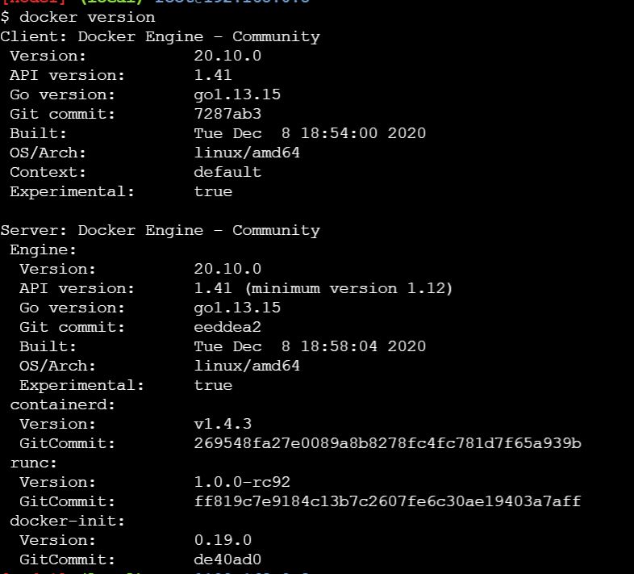

### Containers: Big Picture
* Applications are heart of business.
* Most of the Applications run on Servers
* Earlier we used to run one application on each server
* Then we had hypervisors which helped in creating virtual machines
* VM’s are great but they are far from perfect
* Every vm requires its own dedicated OS is a major flaw, Every OS consumes CPU, RAM and other resources that could otherwise be used to power more applications
* For a long time, big players like Google have been using container technologies to address the shortcoming of vm model
* But an organization called as Docker Inc has made it very simple to create container which was not the case earlier
* Companies like Microsoft joined hands with Docker and made changes in their OS to accomodate docker container


## Lab Environment
* Create a Docker hub account [Refer Here](https://hub.docker.com/signup)
* Once your account creation is completed login into docker playground [Refer Here](https://labs.play-with-docker.com/) using docker hub account.


* To toggle full screen use ALT+Enter

### More about isolated areas
* Roughly isolated area is analogus to vm but major difference is VMs have a full blow os where as isolated areas (containers) dont have a full blow os.
* Since they dont have full blown os,
   * CPU and other resources are allocated to application rather than os
   * This reduces the overhead of OS Patching
   * Savings on cost as containers on license costs


* Every container (isolate area) gets
    * CPU
    * RAM
    * Storage
    * Network (ip address)

* We will be using docker to create these isolated areas called as containers.
* Docker is british expression for Dock Worker who is responsible for loading and unloading container in the ship yard.


### Intro to Linux Containers

* Modern container started in the Linux world and are product of immense contributions for over a period of time from organizations such as Google LLC
* Some of the major technologies in Linux which contributed to massive growth of containers are
     * kernel namespaces
     * control groups
     * union filesystems
     * Docker

## Windows Containers
* Microsoft corp has worked along with Docker to bring container technologies to Windows Platform
* Windows Container can be created on
     * Window 10 (Non Home editions)
    * Windows Server 2016 and Later
* Microsoft had changed the core Window Kernel to implement Containers.

## Docker Technology

* When we install docker, we have the following components installed into our machine
   * docker client
   * docker daemon (engine)
* Login into docker play ground create an instance and execute ``` docker version ```




* Lets try to create one container
   * from docker client we need to specify we need a container
   * lets use a simple image called as hello-world
* To run a docker container we need a docker image. Docker has hub which hosts lots of images


* Now lets summarize the steps


* Now lets try to create one more container with hello-world


* So to create container we need images. In reality in container we would want to run our applications developed
* So we need to create images with our applications in it to create containers
* So the first task for us is to understand how to create images so that we can run our applications

Terminology:
  * In case of Docker we will be packaging our applications as Docker images.


