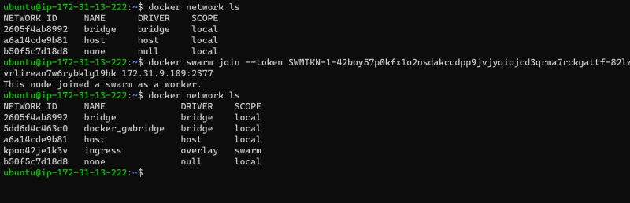
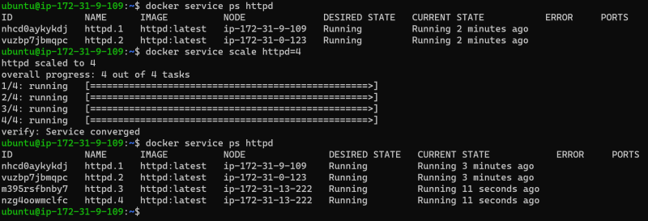

## Docker Multi Host Networking
* In Docker Overlay network driver provides multi host networking
* Docker Swarm uses overlay networking to communicate between multiple Docker Hosts.
* How Packets flow through the Overlay Network Driver


* In this diagram, the packet flow on an overlay network is shown. Here are the steps that take place when c1 sends c2 packets across their shared overlay network:

```
* c1 does a DNS lookup for c2. Since both containers are on the same overlay network the Docker Engine local DNS server resolves c2 to its overlay IP address 10.0.0.3.
* An overlay network is a L2 segment so c1 generates an L2 frame destined for the MAC address of c2.
* If this is the first time c1 has contacted c2, c1 issues an ARP request for c2, which is answered by the local operating system using an entry statically programmed by the local Docker Engine.
* The frame is encapsulated with a VXLAN header by the overlay network driver. The distributed overlay control plane manages the locations and state of each VXLAN tunnel endpoint so it knows that c2 resides on host-B at the physical address of 192.168.0.3. That address becomes the destination address of the underlay IP header.
* Once encapsulated the packet is sent. The physical network is responsible of routing or bridging the VXLAN packet to the correct host.
* The packet arrives at the eth0 interface of host-B and is decapsulated by the overlay network driver. The original L2 frame from c1 is passed to c2's eth0 interface and up to the listening application.

```
* When you create overlay network as mentioned in the swarm series, two network drivers are create

    * Overlay: This points to the overlay network
    * docker_gwbridge: The egress bridge is for traffic leaving the cluster. only one docker_gwbride exists per host. This bridge is used for ingress/egress communications not for container to container communications with in overlay.
* The underlying internal architecture look like this


* In this series lets try to understand concepts of the Docker Overlay Network Driver
* To create a overlay network in docker we use docker swarm.
* Docker Swarm gives management & Orchestration features
* In Docker Swarm we specify desired state (i want some application to be run in two containers and swarm will try to maintain the state)


* Lets create 3 nodes in aws and install docker in it


* Lets understand some key terms in docker swarm
    * Swarm: Multiple Docker hosts run in swarm mode to act as managers and workers
    * Task: The manager distributes the tasks to run inside the nodes. A task consists of a Docker container and the commands to run inside the container
    * Service: This defines the task
    * Node: An individual system with docker installed
* Manager node initializes the swarm cluster by using the ip address of manager


* Now lets login into the nodes which would like to join the swarm as a worker node




* now lets login into the worker node and execute the following


* Lets try to create a service where we describe the number of replicas

```
docker service create --replicas 2 --name httpd httpd:latest
```


* Now lets scale the number of replicas

```
docker service scale httpd=4
```




* Lets create a service by exposing ports


* Lets login into the container and check the network interfaces


