## Docker Compose
* This is a tool for defining an running multi container Docker applications
* All the modern applications will have the some/all of the following components

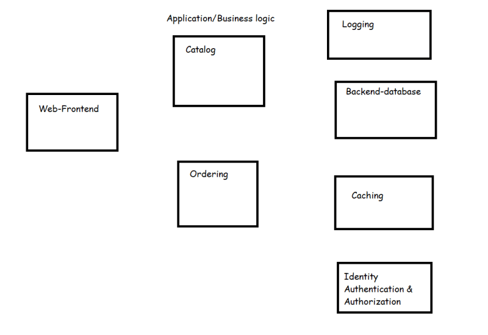

* When all of these components work together we have a successful application
* Lets understand microservices
* To bringup our application we need to run multiple containers in a specific order.
* Docker compose is one approach to bring up multiple container of your application on a single docker host platform.
* Docker compose is widely used in Developer environments

## How to work with Docker compose

* In Docker compose we create a file called docker-compose.yaml and we specify the containers to be created, their network, their volumes as specified in docker compose specifications [Refer Here](https://docs.docker.com/compose/compose-file/)
* In with the code repository docker-compose.yaml is commited to make it easier to bring up multiple containers to run an application

* Docker-Compose is pre-installed when you install docker on mac and windows 10

* On Linux machines we need to install docker-compose [Refer Here](https://docs.docker.com/compose/install/)

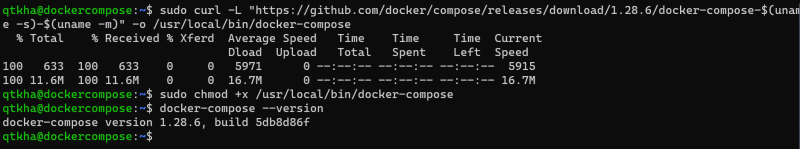

* Hello-world:
    * In this lets try to create a httpd container and nginx container
    * [Refer Here](https://raw.githubusercontent.com/DevopsEasy/DockerClass/main/compose/hello-compose/docker-compose.yml) for the docker-compose.yaml

    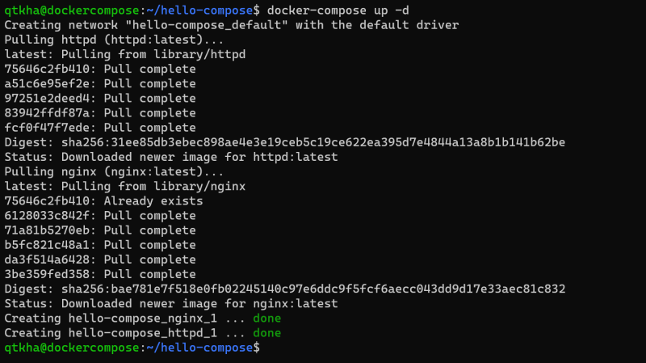

    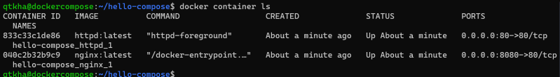

    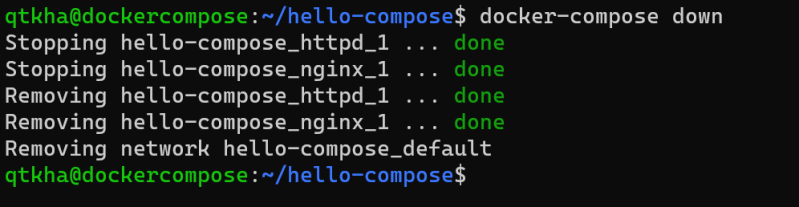


* Building images and running containers
   * [Refer Here](https://github.com/DevopsEasy/DockerClass/blob/main/compose/build-compose/gol/Dockerfile) for the docker-compose.yaml
   * Execute the commands
     ```
     docker-compose build
     docker-compose up -d
     docker container ls
     docker image ls
     ```
     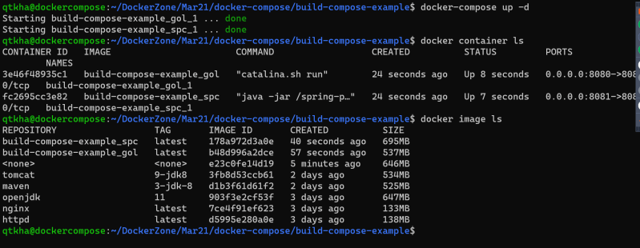

    * Creating a docker-compose file with a network and volume
    * [Refer Here](https://github.com/DevopsEasy/DockerClass/blob/main/compose/network-compose/docker-compose.yml) for the docker-compose file
    * Execute-commands

    ```
     docker-compose build
     docker-compose up -d
     docker container ls
     docker image ls
     docker volume ls
     docker network ls
    ```
    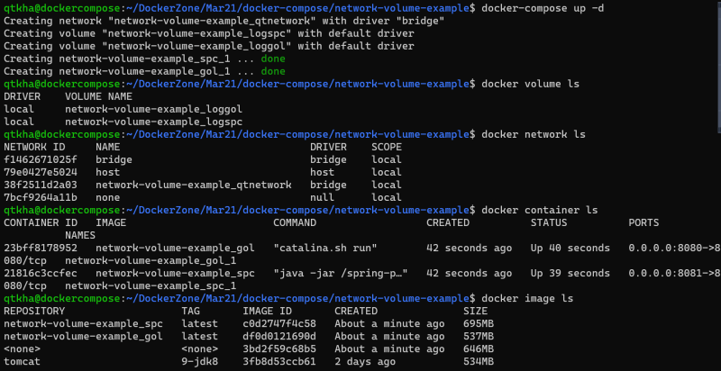

## Run container in Production Environments
* We generally run Production environment on multiple servers
* So if we run our application which is microservices in the production environment, We have to deal with
     * Multiple containers
     * Ensure that the containers are running
     * We need to scale the containers depending on demand
     * We need to persist the volumes
* A distributed systems cluster is a group of machines that are virtually or geographically separted and they work together to provide the same service or applications to clients
* A distributed system can help
    * There is no single point of failure (SPOF)
    * This design supports scalability
    * The data is shared b/w all machines
    * The design is readable
* Consensus is the task of getting all the systems ina group agree on some specific values based on votes. Docker swarm uses raft consensus algorithm [Refer Here](https://raft.github.io/)
The configuration or state of the system will be stored in the database on all managers. In the case of docker swarm this database is etcd
* We need to manage networks for multiple nodes and we already know about overlay
* Docker Swarm supports loadbalancing to interact with services externally as well as internally
* How can we deploy our application i.e. new microservice version in container with out downtime?
* Docker has a swarm mode which is running docker containers on multiple nodes with cluster features
   * Manager & Worker nodes
   * Multi node networking
   * Loadbalancing
   * Deployments
   * Scalability
* To be very frank industry has majorly adopted kubernetes as the orchestration technology for running contaniers in production.
* To run multiple applications on docker swarm which is
* Service => Task
* Docker has developed a docker stacks or you can use docker command line

## Running Docker Containers
* With CPU Limits

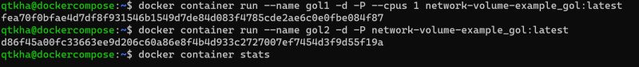

* With memory limits

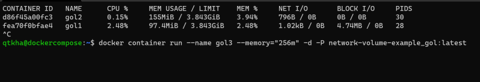

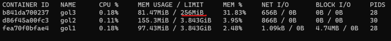

* [Refer Here](https://docs.docker.com/config/containers/resource_constraints/) for limiting cpu, ram for docker container
* Docker container allows us to change few configurations while the container is running

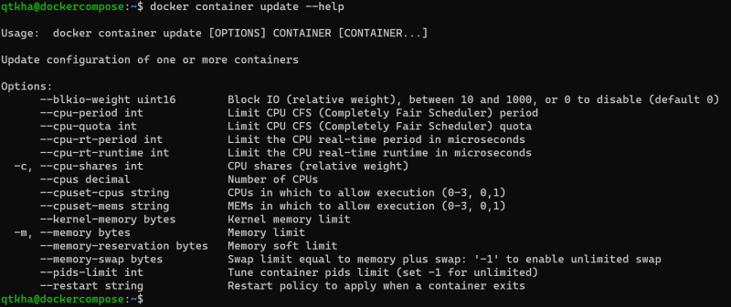
