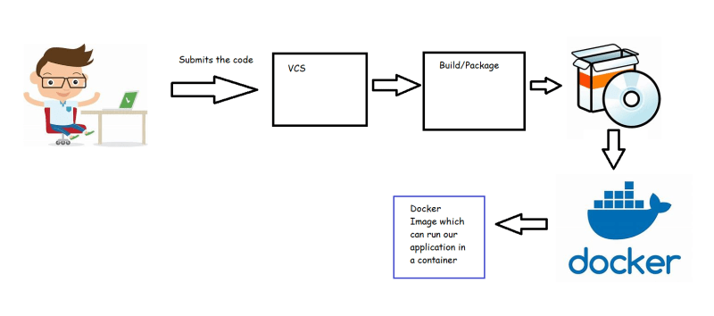
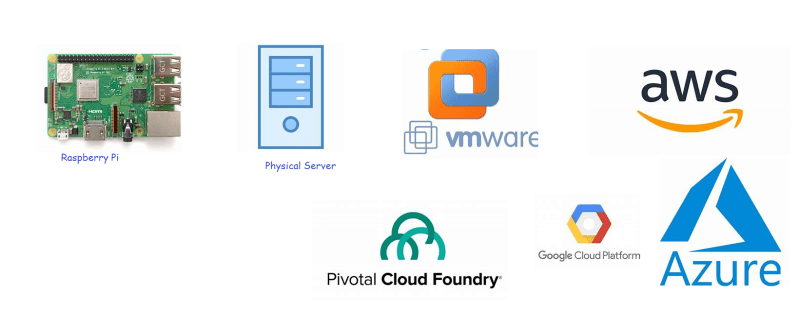
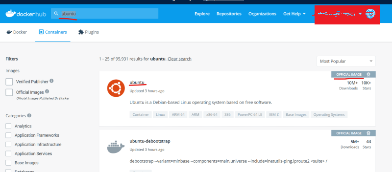
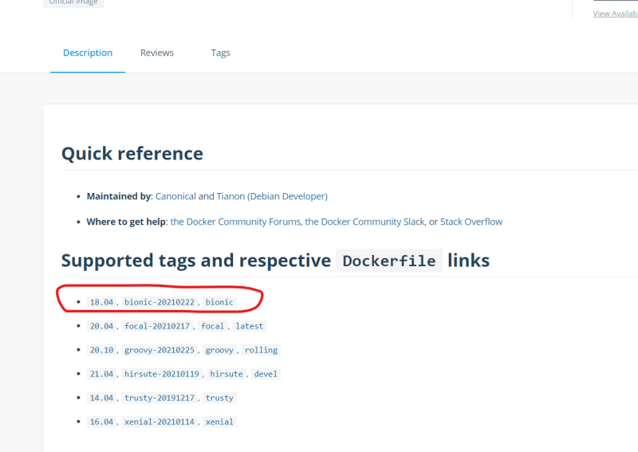

## Docker Image
* We need to package the applications developed in our organization as docker images.



## Advantages of docker images:
* Running an app on docker will give more priority to cpu and other resources consumed by application rather than os
* Cost Reduction: On one host we can run multiple applications seamlessly which reduces hardware costs and os costs
* Docker is extremely portable, Docker container literally runs anywhere



## Installing Docker
* Lets install Docker on a linux machine
* We can create a linux vm on any cloud
    * aws
    * azure
    * gcp
* Lets create a ubuntu instance in aws cloud
* For installing docker we will be using the shell script approach which installs the latest version on linux
[Refer Here](https://get.docker.com/)
* Login into the vm
* Execute following commands
```
sudo apt update
curl -fsSL https://get.docker.com -o get-docker.sh
sh get-docker.sh

```
* In order to execute Docker as Ubuntu user
```
sudo usermod-aG docker ubuntu
#exit & relogin
docker info
```
## First look at building docker images
* Lets take the lampstack as an example [Refer Here](https://www.digitalocean.com/community/tutorials/how-to-install-linux-apache-mysql-php-lamp-stack-ubuntu-18-04)
* First step is to make a note of all the steps required to install/configure your application manually on linux/windows machine
* Then try to create a Dockerfile which consists of instructions to install/configure your application
* Dockerfile is a text file which consists of set of Instructions to build a docker image
* Lets try to make a note of steps to manually create a lamp server on ubuntu server

```
sudo apt update
sudo apt install apache2 -y
sudo apt install php libapache2-mod-php php-mysql php-cli -y
echo '<?php phpinfo(); ?>' | sudo tee /var/www/html/info.php
```
* Basic docker image creation process is
   * choose a base image
   * add your installation/configuration steps
   * create the new image
* To choose a base image navigate to [Refer Here](https://hub.docker.com/search?q=&type=image)



* In docker the version of image is referred as tag [Refer Here](https://hub.docker.com/_/ubuntu)
* Since our steps are based on ubuntu 18.04 lets choose the tag



* Lets try to manually check if the image will work or not
* So lets try to create a container with the ubuntu image and 18.04 tag

```
docker container run -it <image> /bin/bash

```
* In docker convention is ``` <image-name>:<tag> => ubuntu:18.04 ```

```
docker container run -it ubuntu:18.04 /bin/bash

```
* This command creates a ubuntu 18 container and you will be logged in to the container as a root user.
* For commands start using cheatsheet [Refer Here](https://www.docker.com/sites/default/files/d8/2019-09/docker-cheat-sheet.pdf)
* In the container we have executed the following steps

```
apt update
apt install apache2 -y
apt install php libapache2-mod-php php-mysql php-cli -y
echo '<?php phpinfo(); ?>' | tee /var/www/html/info.php
service apache2 start

```
* The way to write Dockerfile contents
```
FROM ubuntu:18.04
RUN apt update 
RUN apt install apache2 -y
RUN apt install php libapache2-mod-php php-mysql php-cli -y
RUN echo '<?php phpinfo(); ?>' | tee /var/www/html/info.php
RUN service apache2 start
EXPOSE 80

```
* Lets look at some Dockerfiles created by community
   * ubuntu [Refer Here](https://github.com/tianon/docker-brew-ubuntu-core/blob/d8b441737e0291a5c1c99f817ff1ba9ab6ccac11/bionic/Dockerfile)
   * tomcat [Refer Here](https://github.com/docker-library/tomcat/blob/d424ec06ddd6349b97bcbdc2d5907030a35bdc84/10.0/jdk15/openjdk-buster/Dockerfile)


