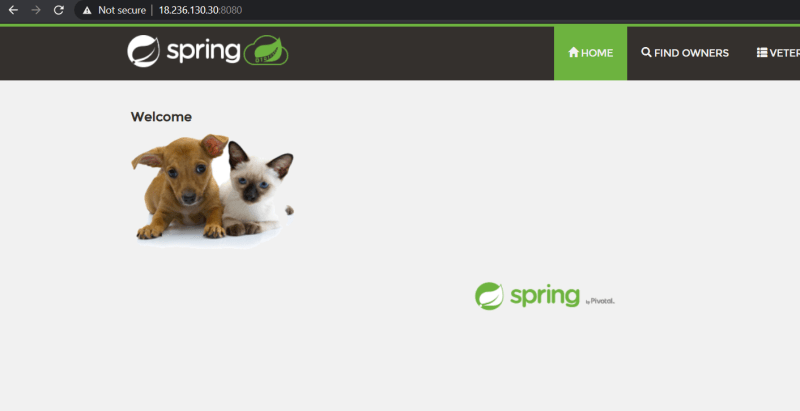

## Dockerfile

* Docker can build images by reading instructions from a Dockerfile
* Lets take one more application as an example
    * This application is based on java
    * This application runs on port 8080
* Lets try to install this java application on a linux machine first
* create a ubuntu linux vm on any cloud. login into linux machine using ssh
     * install java
     * download spring pet clinic application

```
sudo apt update
sudo apt install openjdk-8-jdk wget -y
java -version
wget https://spc-jar.s3.us-west-2.amazonaws.com/spring-petclinic.jar
java -jar spring-petclinic.jar
```
Now navigate to ``` http://<publicip>:8080 ```



* To create a docker
   * We have to choose a right base image
       * You can choose ubuntu and perform all the steps
       * Choose a image where java is already installed
   * To build Dockerfile we will be using instructions [Refer Here](https://docs.docker.com/engine/reference/builder/)
   * So lets build a Dockerfile using ubuntu:18.04 image
       * To set the base image we will be using FROM instrution [Refer Here](https://docs.docker.com/engine/reference/builder/#from)
       * Now we need to divide our commands which we use to install/configure our application into two sections
           * application installation/configuration steps. All the configuration steps we will be using can be written in Dockerfile with RUN instruction [Refer Here](https://docs.docker.com/engine/reference/builder/#run)

           ```
           apt update
           apt install wget openjdk-8-jdk -y
           wget https://spc-jar.s3.us-west-2.amazonaws.com/spring-petclinic.jar
           ```
           * application execution steps. Execution steps will be configured with instruction CMD [Refer Here](https://docs.docker.com/engine/reference/builder/#cmd)

           ```
           java -jar spring-petclinic.jar
           ```
           * Our application when executed might require some port to connect, in this case the port is 8080, we use EXPOSE instruction to specify ports of application [Refer Here](https://docs.docker.com/engine/reference/builder/#expose)
           * Create a folder and then place the Dockerfile in it. Now build the docker image using docker image build command [Refer Here](https://docs.docker.com/engine/reference/commandline/image_build/)

           ```
           FROM ubuntu:18.04
           RUN apt update
           RUN apt install wget openjdk-8-jdk -y
           RUN wget https://spc-jar.s3.us-west-2.amazonaws.com/spring-petclinic.jar
           EXPOSE 8080
           CMD ["java","-jar","spring-petclinic.jar"]
           ```
           * Now build the docker image

           ```
           docker image build -t spc:ubuntu .
           ```
           * Now lets check the docker images in the local machine (local repository) docker image ls [Refer Here](https://docs.docker.com/engine/reference/commandline/image_ls/)
           * Building a Image using openjdk image
           * To copy the jar file into container use the ADD instruction [Refer Here](https://docs.docker.com/engine/reference/builder/#add)

           ```
           FROM openjdk:8
           ADD https://spc-jar.s3.us-west-2.amazonaws.com/spring-petclinic.jar /spring-petclinic.jar
           EXPOSE 8080
           CMD ["java","-jar","/spring-petclinic.jar"]
           ```
           * Lets try to build the docker image

           ```
           docker image build -t spc:openjdk .
           ```
           * Lets view the docker image in the local registry

           ```
           docker image ls
           ```
           * Now lets try to run the application in a docker container using two images which we have built

           ```
           docker container run -d -P spc:ubuntu
           docker container run -d -P spc:openjdk
           docker container ls
           ```
           * To build a docker image for an app we will have multiple approaches, try to use the approach which is simpler and which results in consuming less resources
           * Slim JDK Image

           ```
           FROM openjdk:8-jre-slim
           ADD https://spc-jar.s3.us-west-2.amazonaws.com/spring-petclinic.jar /spring-petclinic.jar
           EXPOSE 8080
           CMD ["java",  "-jar",  "/spring-petclinic.jar"]
           ```
