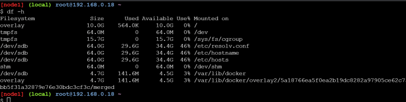

## Lets understand how docker works
* In the below example i have created one container and this container is running

* Before we understand what is happening lets do some experiments
    * Lets execute top on the vm where docker is installed

       

    * Now lets examine the storage in the vm where docker is installed (host)

       

    * On the machine we have cpu, ram and storage and the operating system is creating processes to run applications
    * Let me create a alpine container and log in to the container
      

      

     

    

    

    * Inside the container we have cpu, ram, process tree, disks and we have network
## How are Isolations Created & Resource Limits Applied ?
* Isolations on the linux machines are created using a linux kernel feature called Namespaces.
* Resource Limits are applied using kernel feature called as cgroups (Control groups).

* Working on namespaces & cgroups are difficult, but here comes the docker to the rescue.
* Docker Engine makes it easy to create isolated areas & resource limits.

## Namespaces
* Namespaces is a linux feature.
* To be very specific,

* pID namespace (Process Namespace) creates the isolated process tree inside container

* net namespace (Network Namespace) creates the isolated networking for each container with its own network interface.

* mount namespace creation allows each container to have a different view of entire systems mount point, this allows containers to have their own file system view which starts from root

* We are referring to the containers as isolations. These isolations recieve
    * an disk storage with os
    * network interface to connect to network
    * cpu
    * ram
* In linux these isolations are created by a feature of linux kernel which is called as Namespaces & the Resource Limits is applied to isolation using a feature called as control groups
* Docker has made it simple to create isolations and applying resource limits
* In linux we have different namespaces
    * pID namespace (process namespace)
    * net namespace
    * mount namespace
* The resources are applied to your system using control groups

* Lets try to understand docker architecture and how the container is created in docker.
* Docker Engine is the core software that runs and manages containers
When docker was first released docker engine had two major components
   * Docker daemon:
       It had all the code for the docker client, docker api and runtime, image builds etc.
   * LXC: provided the docker daemon with access to fundamental building blocks of container like namespaces and control groups

* LXC is linux-specific, which was from linux opensource project. Whenever there was a new release of linux kernel and changes in the lxc would impact docker containers
* Docker Inc. developed their own tool called as libcontainer as a replacement for LXC.
* Docker has become huge success and docker had started adding lot of features, These features made docker fat
* During this time frame a company called as CoreOS (acquired by RedHat acquired by IBM) didn’t like the way docker did certain things, so they created a open standard called as appc. The implentation of this spec called as rkt (rocket)
* Docker has started working with many organizations to build OCI (open container initiative)
* OCI published two specifications (standards)
   * the image-spec
   * the runtime-spec

## Docker Architecture:

* Docker as a technology relies on three things
* The runtime:
  * This works at lowest level and is responsible for starting,stopping, creating containers which means this speaks with os constructs such as namespaces and cgroups
  * The low level runtime is called as runc (This is reference implementation of OCI runtime-spec). Job of runc is to interface with underlying OS and to start and stop containers. Every running container on a docker has a runc instance managing it
  * The higher-level runtime is called as containerd and this manages the lifecycle of container including pulling images, creating network interfaces and managing run-c
  * In Typical docker installation has a single containerd process and runc instances are associated with each container.
* The Daemon (engine)
    * The docker daemon (dockerd) sits above containerd and performs higher level tasks such as exposing Docker remote API, managing images, managing volumes, managing networks etc
* The Orchestrator
    * When we want to create a cluster of nodes running Docker, then this Orchestrator comes into play

