### Influence of the OCI on Docker
* Image representing the influence


* When we start a new container what happens?

```
docker container run httpd:latest 
```

* When we type this command into the Docker CLI, the client converts the command into appropriate API and POSTs them to the API endpoint exposed by Docker daemon.
   * In the Linux machine by default the is exposed on local socket ``` /var/run/docker.sock ``` and in Windows machine this API is exposed ``` \pipe\docker_engine ```
* Once the daemon recieves the command to create a new container, it makes a call to containerd. Daemon communicates to containerd via CRUD-style API over gRPC
* Containerd converts the required Docker image into an OCI bundle and tells runc to create a container.
* runc interfaces with the OS kernel to pull together all the constructs necessary to create containers and the container process is started as the child-process of runc and as soon as container is started runc will exit.
* Shim is integral part of the implementation of daemonless containers.
* In the old mode where all the container run time was implemented in daemon , starting or stopping the daemon would kill all the running containers. Especially when new version of Docker has to be upgraded on the Production Servers the containers will be killed which leads to downtime.
* It is mentioned above that containerd uses runc to create new containers. In reality, it forks a new instance of runc for every container it creates.
* Once the container is create the parent runc process exits.
* Once a container parent process exits, the associated containerd-shim becomes the parent of the container.
* The responsibility of shim include
   * keeping any stdin and stdout streams open so that when the daemon is restarted the container doesn’t terminated
   * Reporting the container exit status back to the daemon

### Docker Images
* To create docker containers we need docker images. Images are considered build-time constructs and containers are run-time constructs

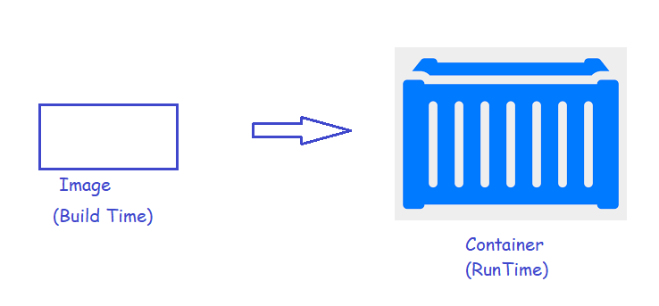

* Create a new docker play ground instance
* Docker host will have a local image repository which is usually located
   * Linux => ``` /var/lib/docker/<storage-driver> ```
   * windows => ``` c:\programdata\docker\windowsfilter ```
* The process of getting images into the local image repository is called pulling. so lets try to pull the tomcat:8 image

```
docker image pull tomcat:8
docker image pull redis:latest
docker image pull alpine:latest
```
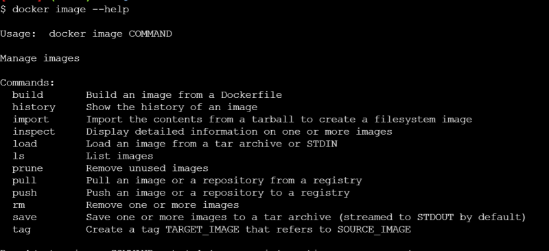
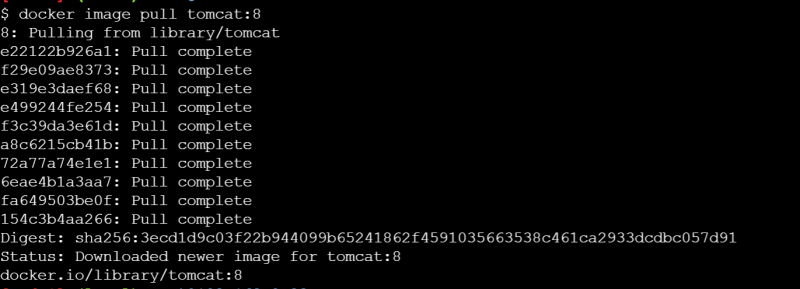
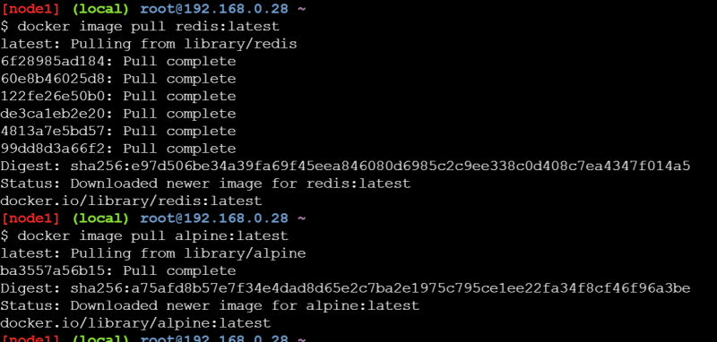

* Lets get the list of the docker images

    ``` docker image ls ```


* By default docker images are pulled from the default registry which is docker hub.
* Image registries:
     * We store docker images in a centralised locations referred as image registry. The purpose is to share and access docker images
     * The most common registry is docker hub [Refer Here](https://hub.docker.com/)
     * There are other registries
        * Elastic Container Registry (ECR)
        * Azure Container Registry (ACR)
        * Jfrog docker registry [Refer Here](https://www.jfrog.com/confluence/display/JFROG/Docker+Registry)
        * Google container Registry
    * Execute ``` docker info ```

    

    * Image registries contain one or more image repositories. Repositories will container one or more images of the same application with different tags

    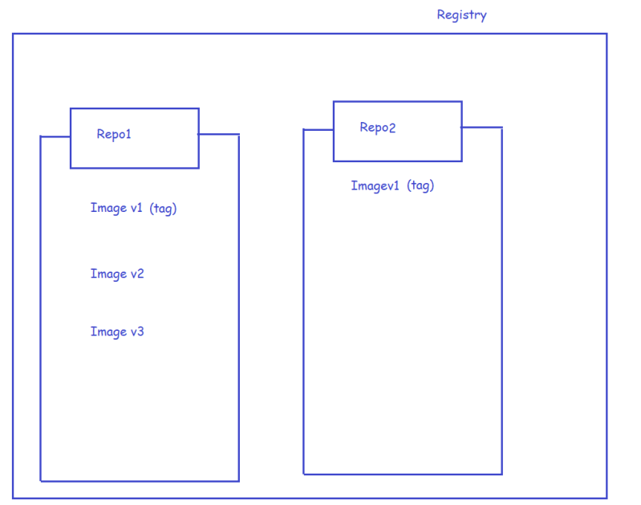

    * Image naming and tagging
       * docker images are generally available in the following format ``` <repository>:<tag> ```
       * when you don’t specify tag docker assumes latest as a tag

       
       

## Dockerfile
* A Dockerfile is a text file which contains instructions on how to create a Docker image.
* Dockerfile consists of instructions in the following format

``` DIRECTIVE/INSTRUCTION argument ```

* In Dockerfile any line which starts with # is a comment
* FROM instruction/directive is used to choose the base image

``` FROM <image>:<tag> ```
* If you want to build a docker image from scratch

``` FROM scratch ```

* LABEL: The Label is the key value pair to add metadata to the Docker Image

``` LABEL <key>=<value> ```

```
LABEL maintainer=devops@easy.com
LABEL version=1.0
LABEL maintainer=josef@de.com version=1.0
```

* Now lets apply LABEL’s and comments to the Dockerfile which we have used to build the spring pet clinic.

```Dockerfile
FROM openjdk:8
# base image is openjdk
LABEL author="Josef Jackson"
LABEL maintainer="devopseasy@gmail.com"
# Downloading the image from the url
ADD https://spc-jar.s3.us-west-2.amazonaws.com/spring-petclinic.jar /spring-petclinic.jar
# spring pet clinic runs on port 8080
EXPOSE 8080
# command to start the application
CMD ["java",  "-jar",  "/spring-petclinic.jar"]
```

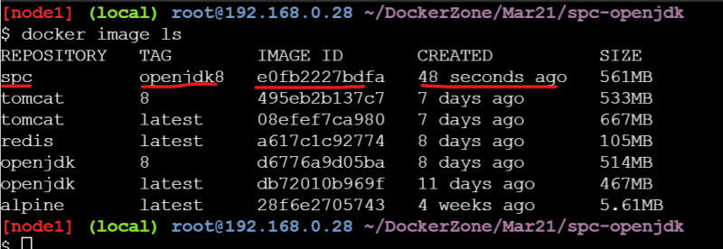

* Lets try to inspect the image which we have built

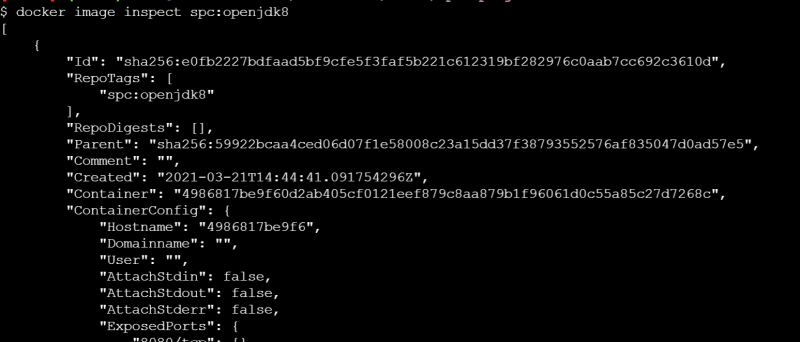

* Lets inspect the image which we have built to find a section called as layers and also its base image

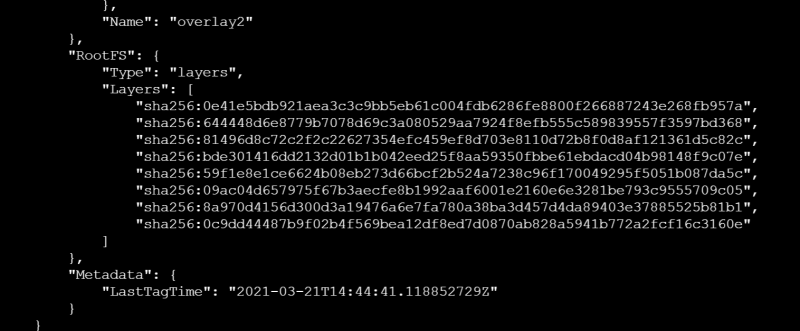


* If we examine the result is in the spc we have one extra layer

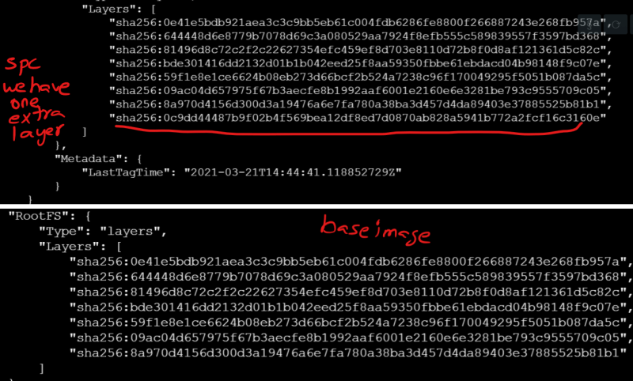


* Docker image is collection of layers


* When we create a docker image from some base image the layers are reused 

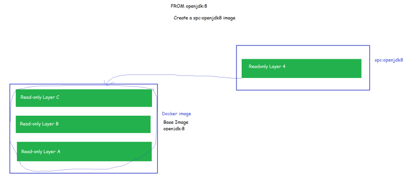

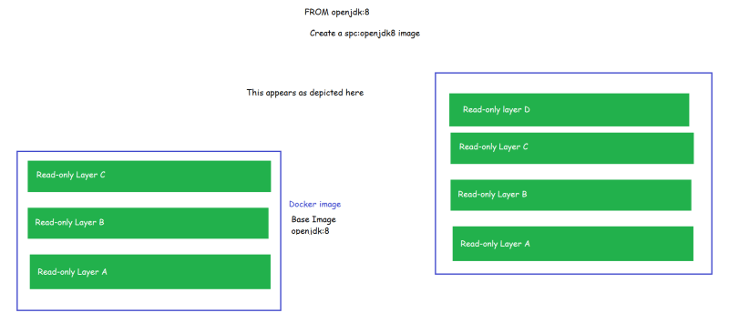

* The layers are created while building the image if there are any changes done on the filesystem. The instruction which might lead to additional image layer creations are ADD, COPY and RUN
* Now lets experiment with the RUN instruction. The docker file which will be used is

```Dockerfile
FROM ubuntu:latest
RUN apt update
```
* First lets pull ubuntu:latest image and the inspect the layers

```
docker image pull ubuntu:latest
docker image inspect ubuntu:latest
```


* we have 3 image layers


Now lets create our Dockerfile and build a image called as layerdemo


* Now lets inspect for image layers


* One additional layer is created as a result of apt update
* These layers are read-only no container or no image can make changes in the layers


