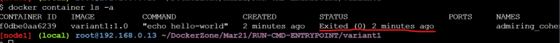
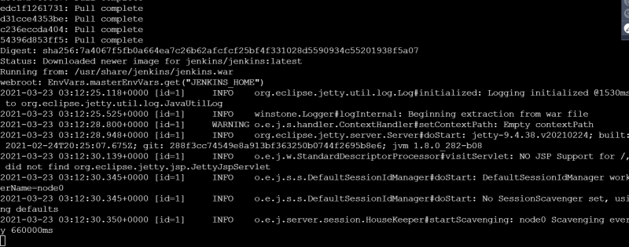
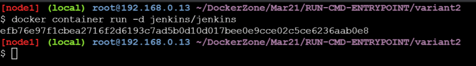

### Building Docker Images and understanding Containers

## RUN instruction
* RUN is used to execute the commands during docker image build time. This will lead to creation of a new layer on top of existing layer
* [Refer Here](https://docs.docker.com/engine/reference/builder/#run) for the official docs
* In docker the syntax of RUN command

```
 RUN <command> 
 ```
* In docker commands can take two formats
     * shell format: You write the command as you execute on the shell

     ```
     RUN touch 1.txt
     ```

     * exec format: you write the commands in the form of  ``` ["executable", "args"] ```

     ```
     RUN ["touch", "1.txt" ]
     ```

* In the RUN command it is often a good practice to combine commands

```
RUN apt update
RUN apt-get install nginx -y
#good practice
RUN apt update && apt-get install nginx -y
```

## CMD Instruction
* CMD is used to provide the default initialization command that will be executed when a docker container is executed to create a container from Docker Image.
* CMD command also can be written in shell form and exec form
* Now lets take an simple example to install apache from the docker base image ubuntu
    * First variant of the Dockerfile
    
    ```Dockerfile
    FROM ubuntu:18.04
    LABEL author="Devops Easy"
    LABEL organization="DevopsEasy"
    RUN apt update -y && apt install apache2 -y
    CMD ["echo", "hello-world"]
    ```
    * Now lets try to build the docker image as we know the Docker Image is a template to create Docker containers
    * The docker image build process is initiated by Docker CLI ``` docker image build ``` and is executed by Docker daemon
    * To generate a Docker image Docker daemon needs to access the Dockerfile.

    ```
    docker image build <context>
    docker image build -t <someimage>:<sometag> .
    ```
    * When we use . as a context all the files in the current directory will be send to docker daemon
    * We can skip sending some particular files to docker daemon by using a Dockerignore file
    * Now lets try to build docker image

    ```
    docker image build -t variant1:1.0 .
    docker image ls
    ```

    * Now lets try to create the container

    ```
    docker container run variant1:1.0
    ```

    * Now lets try to see if our container is running

    ```
    docker container ls
    ```


    * Our container is not running, lets see the status of all the containers

    

    * Why did our container exit. Lets look at CMD
        * The container will be running as long as the command CMD is in running state. Once the command finishes execution docker daemon will assume the containers job is done and exits the container
        * CMD should contain commands which will not exit till your application is alive.
        * The commands which we have written in the CMD can be overwriten

        ```
        docker container run variant1:1.0 pwd
        ```
        

### ENTRYPOINT

* ENTRYPOINT is also used to provide the default intialization comamnd when the container is executed
* ENTRYPOINT command cannot be overwritten by users
* There are cases where Both ENTRYPOINT and CMD are defined in a Dockerfile

```
ENTRYPOINT ["echo", "quality"]
CMD ["thought"]

=> ["echo", "quality" "thought"]
```
* See the below Variant2 Dockerfile

```Dockerfile
FROM ubuntu:18.04
LABEL author="Devops Easy"
LABEL organization="DevopsEasy"
RUN apt update -y && apt install apache2 -y
ENTRYPOINT ["echo"]
CMD ["hello-world"]
```
* Lets build the variant2 image

```
docker image build -t variant2:1.0 .
```
* Now lets run the container

```
docker container run variant2:1.0
docker container run variant2:1.0 devops easy
```

* When we run the container the container by default will be in attached mode i.e. it will redirect stdout to our terminal



* In reality we would not want to run our containers in the foreground/attached mode rather we want to run containers in the background /detached mode

```
docker container run -d jenkins/jenkins
# This command will just output the container id
```


