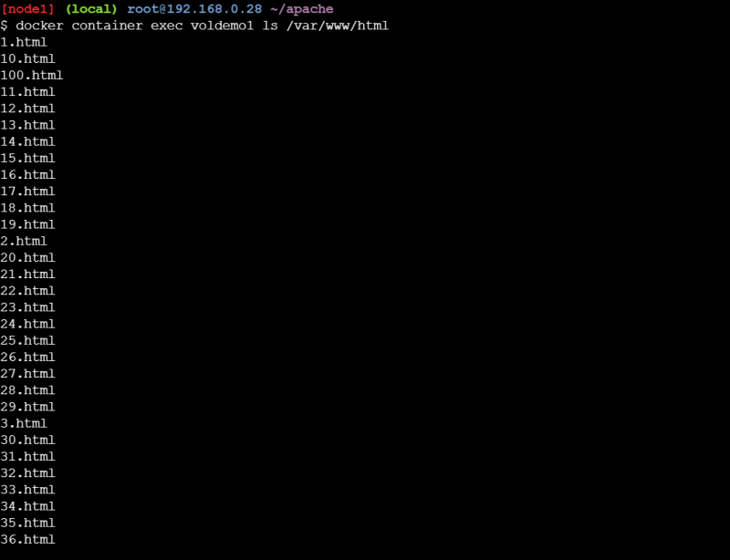
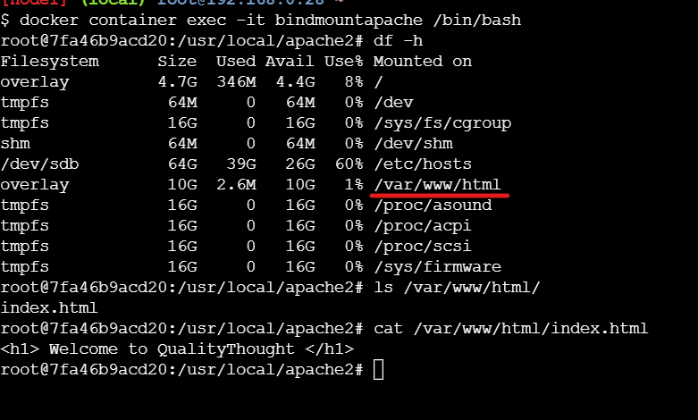

## Docker Storage
* The image layers are organized as shown below


* Lets pull httpd and create 3 containers


* Now lets run the docker container ls -s


* SIZE is the actual size of the r/w layer and the virtual size the combined size of Image layer + R/W Layer


* Docker use Copy-on-write strategy (COW) to make changes in the existing files in the image layers
* To make this layers work docker uses storage drivers. Docker supports the following storage drivers
    * overlay2
    * aufs
    * devicemapper
    * brtfs storage driver
    * zfs storage drivers

* [Refer Here](https://docs.docker.com/storage/storagedriver/select-storage-driver/) for the official documentation.
* When the docker container is deleted the R/W layer is deleted and if the R/W layer is deleted we loose the data generated
* Before trying to resolve this lets try to understand docker container states


* In all of the above states apart from Removed/Dead docker container data is still available on the docker host
* But once we remove the container the data generated in the R/W layer will be deleted


## Docker Volumes
* We can use docker volumes to save the persisted data without relying on containers lifecycle
* If we create a docker volume and attach it to the container, even if the container is deleted the volume will still be available
* First option of creating a volume can be done in the Dockerfile, we can use the VOLUME instruction. for the docker file

```
FROM ubuntu:18.04
LABEL author="Josef Jackson"
LABEL organization="DevopsEasy"
RUN apt update && apt-get install apache2 -y && apt install curl -y
HEALTHCHECK CMD curl -f http://localhost/ || exit 1
VOLUME ["/var/www/html"]
EXPOSE 80
CMD ["apache2ctl", "-D", "FOREGROUND"]
```
* Now lets build the image

```
docker image build -t voldemo:1.0 .
```


* Lets execute the following command

```
docker volume ls
```
* Now lets create a container from this image


* Now lets create some dummy files in the /var/www/html folder



* Now lets inspect volume


* Now lets remove the container


* Now even after we remove the container the volume is still present on the docker host and the data in the /var/www/html folder is retained.
* But this might not be the case as the Dockerfile will not contain volume instruction in all of the cases, so  we need to understand how to use Docker volumes by attaching volumes to the containers
* To attach the volumes to the docker container we need to understand what are different mount types supported by the docker volumes
   * bind mount
   * volume mount
   * tmpfs mount


* In docker mounts can be done by two kinds of commands
   -v
   –mount
* Bind mount
   * for official documentation [Refer Here](https://docs.docker.com/storage/bind-mounts/)
Lets create the container with bind mount

```
docker container run -d --name bindmountapache --mount "type=bind,source=/root/html,target=/var/www/html" -P httpd

docker container run -d --name bindmountapache2 -v "/root/html:/var/www/html" -P httpd
```




* To make the mounts readonly

```
docker container run -d --name bindmountapache3 --mount "type=bind,source=/root/html,target=/var/www/html,readonly" -P httpd

docker container run -d --name bindmountapache4 -v "/root/html:/var/www/html:ro" -P httpd
```
