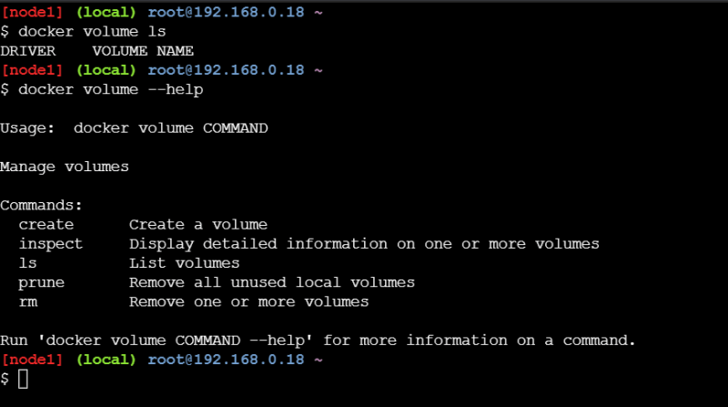
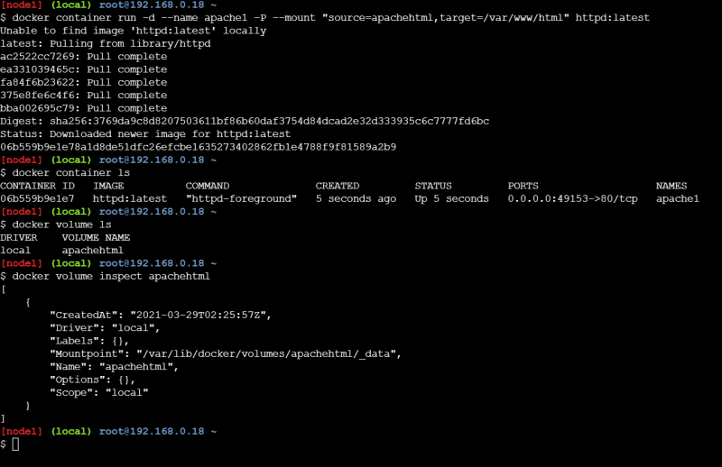
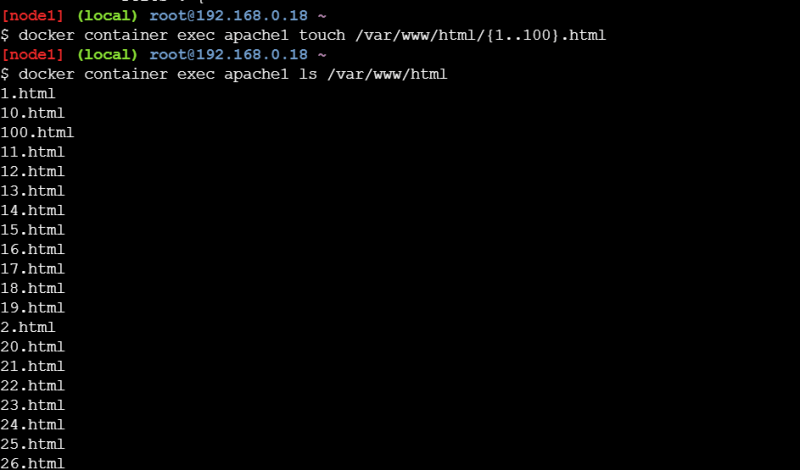
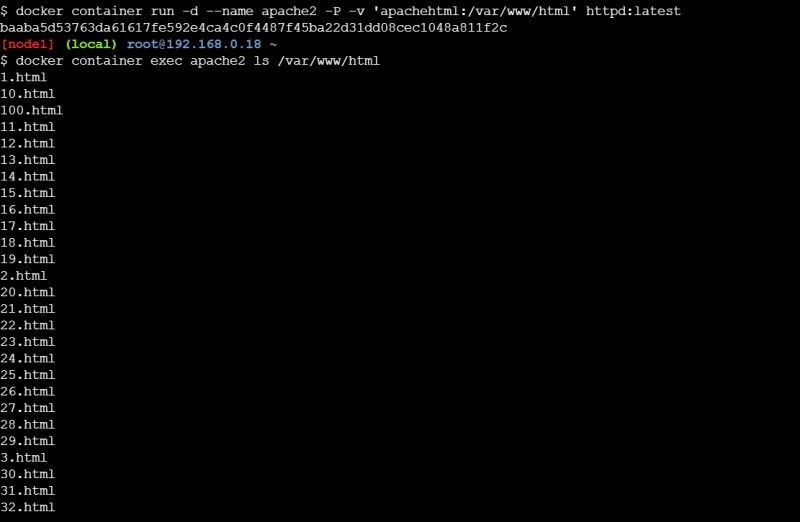
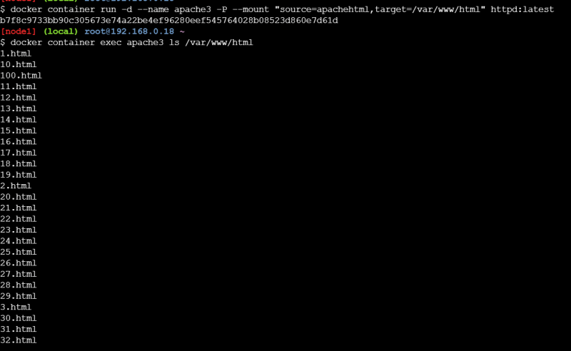
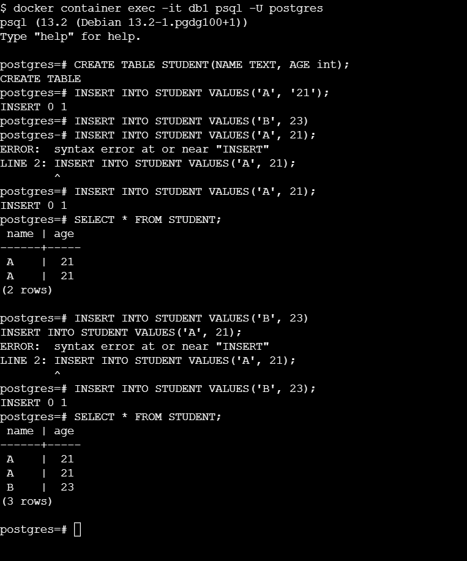
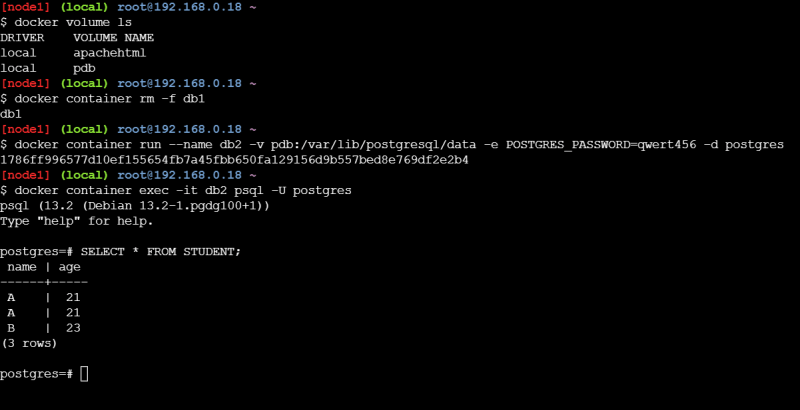
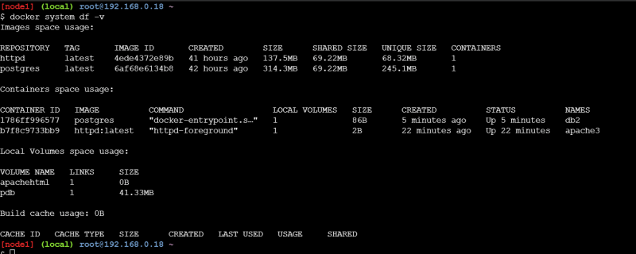
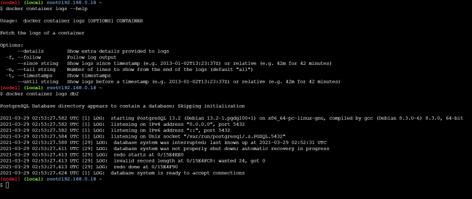

## Docker Volume Mounts
* Docker Volume Mount types


* Lets create a docker volume for the apache html folder 




* Start the container with a volume

```
docker container run -d --name apache1 -P --mount "source=apachehtml,target=/var/www/html" httpd:latest
```



* Now lets verify the mount point in the docker container

```
docker container inspect apache1
```


* Now lets create some files in the /var/www/html folder from the container



* Now lets create a new container and mount the same volume into same folder (-v)

```
docker container run -d --name apache2 -P -v 'apachehtml:/var/www/html' httpd:latest
```



* Now lets delete all the containers

```
docker container rm -f $(docker container ls -a -q)
```


* Now lets create a new container and use the same volume mount

```
docker container run -d --name apache3 -P --mount "source=apachehtml,target=/var/www/html" httpd:latest
```



* Volume driver can help in creating volumes in the
  * nfs
  * cifs
  * cloud
* We need to install volume plugins and then use the volume driver while creating the volume
* [Refer Here](https://docs.docker.com/storage/volumes/#use-a-volume-driver) for the official docs
* Sample AWS Volume plugin [Refer Here](https://docs.docker.com/engine/extend/EBS_volume/)
* Azure volume driver [Refer Here](https://docs.docker.com/registry/storage-drivers/azure/)
* Lets create a Postgres container with volume mounted so that we can preserve the data
* postgres stores the data in the folder /var/lib/postgresql/data
* Lets create a postgres container [Refer Here](https://hub.docker.com/_/postgres)


* Now lets use exec command to create some data in the database





* Containers can run applications of two types
   * Stateless: These applications donot store any data locally, so we dont need volumes for them
   * Stateful: these applications store the data and this data needs to be preserved so for stateful applications we use docker volumes
* Useful docker commands
    * _docker system df_: This command will help in findng out the size of all docker objects in the Host

    
 
   * To get more detailed information use _docker system df -v_

   

* To view the logs we can use the docker

 

* The other approach of storing logs is create a volume for the /var/logs folder and then export the logs from the docker host to central logs.
* The other approach is to have a log client inside the container running which exports logs to centralized log server.
* For tempfs mount [Refer Here](https://docs.docker.com/storage/tmpfs/)
* Next Steps
  * Multi Staged Build
  * Docker Networking
  * Docker Compose
  * Docker Swarm

