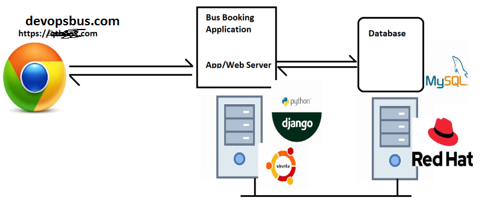
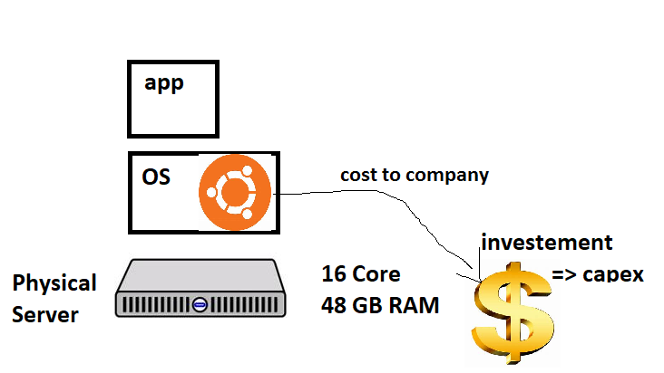
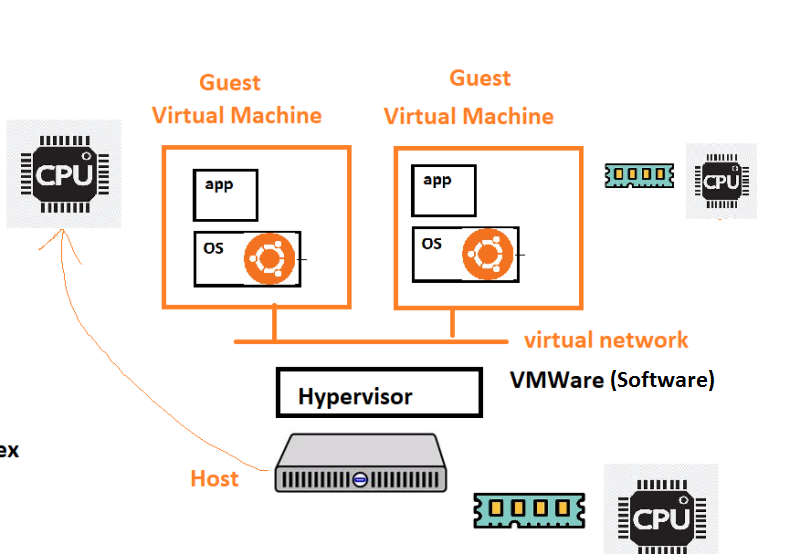
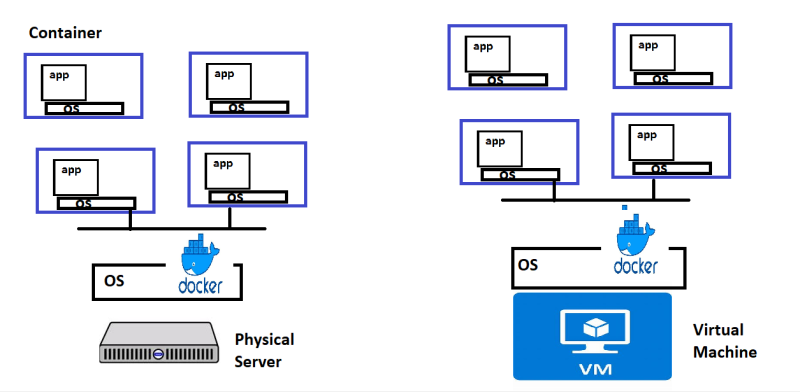
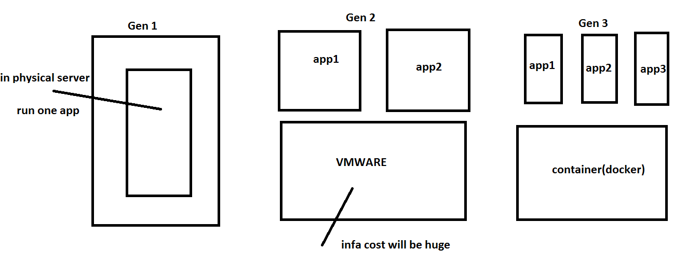
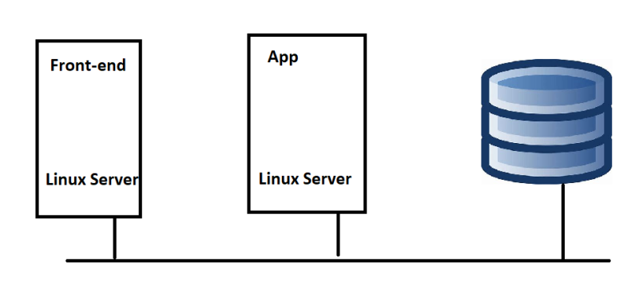
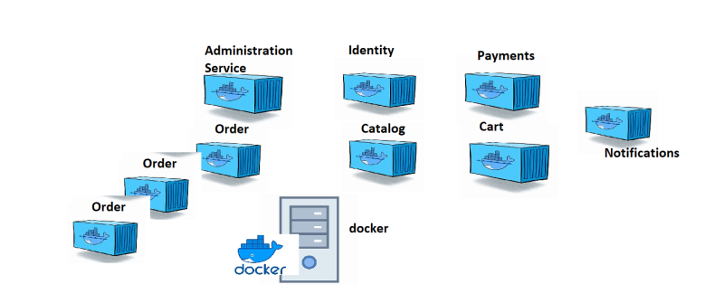
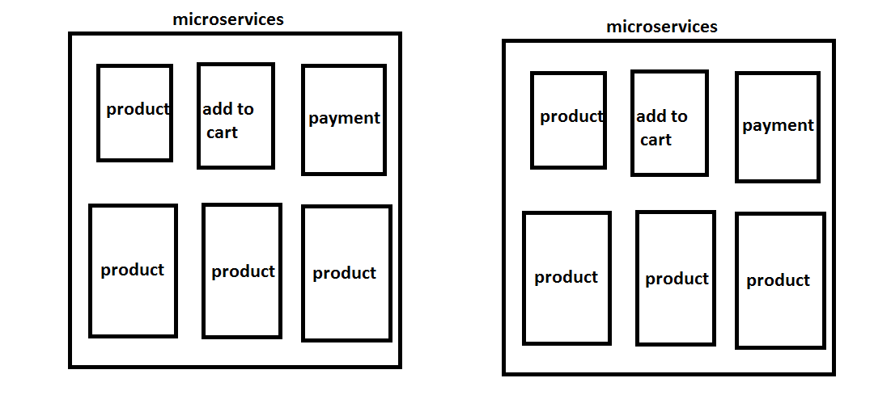

## Generations of Running Applications
* Applications bring revenue, To make applications run we need servers.
* There are 3 major generations/approaches of running applications on servers
* Sample Application Architecture

## Generation 1: Run directly on physical server
* Steps involved
    * Procecure Physical server (costs involved => capex)
    * Install Os (Licensing costs might be involved)
    * Deploy/install application & necessary softwares

* Problems:
   * In the cases of under usage, hardware resources are wasted and Return on Investment will be under question.

   

## Generation 2: Hypervisors
* Install Hypervisor on Physical Server which will help in creating multiple virtual machines

* Hypervisor licensing costs are involved, inaddition to os costs

## Generation 3: Containers
* Container is an isolated area created by container engine (docker) which has a lean os and application runs inside container.
* Each container gets
   * an ip address
   * cpu
   * RAM
   
   
   
   

## The idea of microservices
* Lets look at a typical ecommerce application
* Layered architecture of e-commerce application

* Lets focus on app tier/layer. This does the following functions
    * Administration
    * User Management
    * Inventory
    * Catalog
    * Cart
    * Payments
    * Notifications

* Micro Services:
    * This is all about breaking a monolith to multiple smaller services
    * Each micro service generally represents a module/functionality which can run on its own
    * Smaller changes are possible and replacing services is easier (new versions)
    * Each service can be in different technology.
     
     
     
     
     
     

## What is that we need to do as Devops Engineer
* Make your application/service run inside containers => containerization => Docker
* Ensure we can scale containers automatically/manually (k8s)
Enable CI/CD pipepline to make smaller changes frequently without downtime. (k8s)

## What Next??
* Open AWS or Azure Free tier account: [AWS](https://aws.amazon.com/free/?trk=09863622-0e2a-4080-9bba-12d378e294ba&sc_channel=ps&s_kwcid=AL!4422!3!453325185010!e!!g!!aws%20free&ef_id=CjwKCAiAuOieBhAIEiwAgjCvcpUe0OiK_A_H6Bv5xA-8BwsLLpAxmSsw7e4QwnrdNXUFmxnapvalFxoCmbgQAvD_BwE:G:s&s_kwcid=AL!4422!3!453325185010!e!!g!!aws%20free&all-free-tier.sort-by=item.additionalFields.SortRank&all-free-tier.sort-order=asc&awsf.Free%20Tier%20Types=*all&awsf.Free%20Tier%20Categories=*all) [Azure](https://azure.microsoft.com/en-in/free/)

