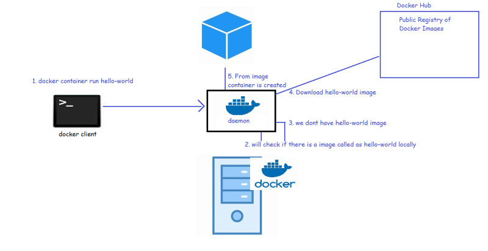
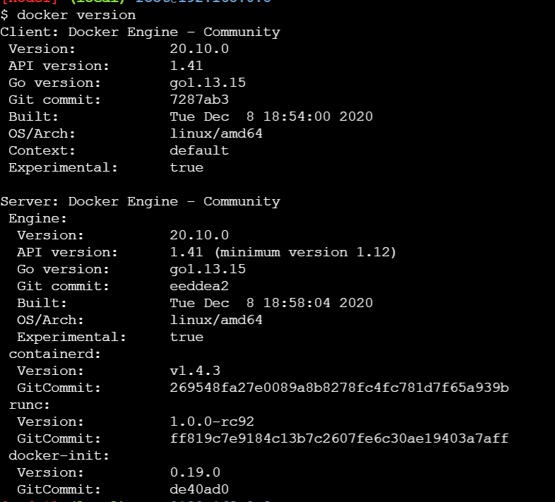
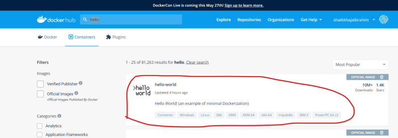
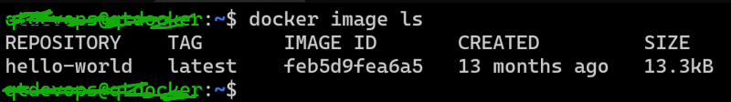
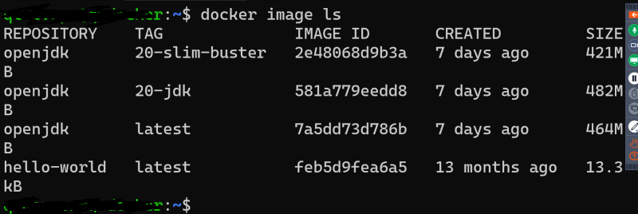
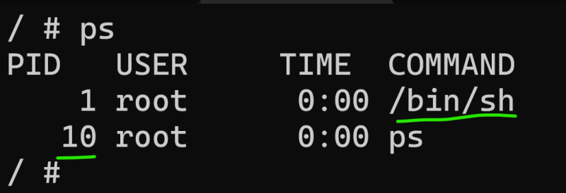
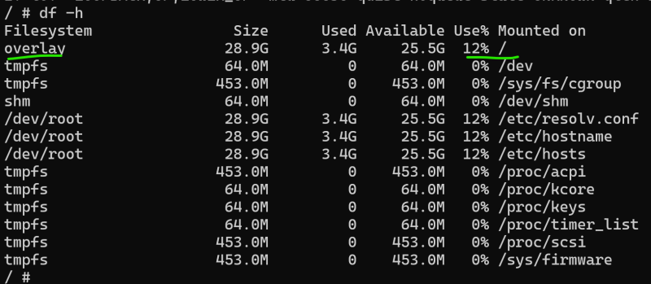

## Container

* [Refer Here](https://www.docker.com/resources/what-container/) for official docker resources.
## Installation
* Docker can be installed on any linux or windows 10+, win 2016+
* Lets create a linux vm in any cloud of your choice.

## Installation on AWS:
* Create a key pair (ensure you select pem format)
* Create a security group and open everything
* To login into linux machine

```
ssh -i <path to pem file> username@ipaddress
cd ~/Downloads
ssh -i .\fordocker.pem ubuntu@44.206.238.229
```
* After login into the linux instance

```
curl -fsSL https://get.docker.com -o get-docker.sh
sh get-docker.sh

sudo usermod -aG docker <username>
#exit and relogin
docker info
# This command should not give any errors
```
* For docker commands use cheatsheet [Refer Here](https://docs.docker.com/get-started/docker_cheatsheet.pdf) for docker cheatsheet.


* Lets try to run the following container

```
docker container run hello-world
Unable to find image 'hello-world:latest' locally
latest: Pulling from library/hello-world
2db29710123e: Pull complete
Digest: sha256:e18f0a777aefabe047a671ab3ec3eed05414477c951ab1a6f352a06974245fe7
Status: Downloaded newer image for hello-world:latest

Hello from Docker!
This message shows that your installation appears to be working correctly.

To generate this message, Docker took the following steps:
 1. The Docker client contacted the Docker daemon.
 2. The Docker daemon pulled the "hello-world" image from the Docker Hub.
    (amd64)
 3. The Docker daemon created a new container from that image which runs the
    executable that produces the output you are currently reading.
 4. The Docker daemon streamed that output to the Docker client, which sent it
    to your terminal.

To try something more ambitious, you can run an Ubuntu container with:
 $ docker run -it ubuntu bash

Share images, automate workflows, and more with a free Docker ID:
 https://hub.docker.com/
```
* From the above logs somestuff got downloaded into my system
* Lets run the same command again

```
 docker container run hello-world

Hello from Docker!
This message shows that your installation appears to be working correctly.

To generate this message, Docker took the following steps:
 1. The Docker client contacted the Docker daemon.
 2. The Docker daemon pulled the "hello-world" image from the Docker Hub.
    (amd64)
 3. The Docker daemon created a new container from that image which runs the
    executable that produces the output you are currently reading.
 4. The Docker daemon streamed that output to the Docker client, which sent it
    to your terminal.

To try something more ambitious, you can run an Ubuntu container with:
 $ docker run -it ubuntu bash

Share images, automate workflows, and more with a free Docker ID:
 https://hub.docker.com/

 ```
* This time nothing got downloaded
* To run a container we need a docker image. In the above commands hello-world was name of the docker image.
* Docker images are available on docker registries. The default docker registry is docker hub [Refer Here](https://hub.docker.com/). [Refer Here](https://hub.docker.com/_/hello-world) for the hello-world image repository in docker hub

* How to create container?

```
docker container run <image-name>
```
* What happens at a highlevel during container creation?
    * docker client forwards the request to docker engine/docker daemon
    * docker engine checks for existence of images locally docker image ls.
    * If the image is not found, it tries to download from the configured registry (by default docker hub is configured)
    * Once the image is downloaded, the docker engine creates a container based on docker image
    * To download the image from registry we use ```pull```. if we create a new image in some machine to make it available in your repository we will be using ```push```

## Image and Tag
* Any docker image represents some application. Every application will have multiple versions.
* In Docker to represent application we use name of image and to represent version we use tag. The convention ``` <image-name>:<tag> ```

```
hello-world => hello-world:latest
```
* If the tag is not passed docker assumes the tag to be ```latest```

* Along with Repository (image name) and tag we also have image-id


## Container Options
* We can perform the following operations
    * Create container
    * Delete container
    * start container
    * stop container
    * pause container
    * unpause container
* Every container when created gets a unique
    * container id
    * container name
* We can set the container name

```
docker container run --help
docker container run --name <cont-name> <image>:<tag>
```
* To see the container running in the docker host ```docker container ls```, to see the status of all the containers created by docker host which are not deleted ```docker container ls --all```
* When the container is created, each container gets its own
    * network ip address
    * RAM
    * filesystem
    * CPU share
* Execute ```docker stats``` to know the cpu/RAM utilization

## Exploring container
* On the docker host execute the folowing commands
    * list all the process ```ps``` or ```ps aux```
    * get the ip address ```ip addr``` or ```ifconfig``` (10.2.0.4)
    * username => qtdevops
    * hostname => qtdocker
    * Explore storage ```df -h``` & ```lsblk```
* Lets create a container and login into that ```docker container run -it alpine /bin/sh```
* Execute the following commands
    * find username and hostname ```whoami``` and ```hostname``` (root & 03558710c5d9)
    * ip address ```ip addr``` (172.17.0.4)
    * examine the running process ```ps```

    

    * examine disk mounts ```df -h```

    
* Based on all of the observations a container looks like a linux machine inside a linux machine i.e virtual machine
* Docker image contains all the necessary files to run whatever application we want inside container.

## Next Steps
* Lets install a java application on a linux machine
* Lets try to also run the same java application inside some container and understand the docker image concept
* Lets create a docker image and also understand its read-only nature.


