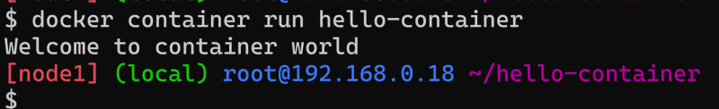

## How are Isolations Created & Resource Limits Applied ?
* Isolations on the linux machines are created using a linux kernel feature called Namespaces.
* Resource Limits are applied using kernel feature called as cgroups (Control groups).


* Working on namespaces & cgroups are difficult, but here comes the docker to the rescue.
* Docker Engine makes it easy to create isolated areas & resource limits


* Every docker container has a command that gets executed when the container is created/started. As long as that command is running the container will be in running state, if that command has finished execution container will be stopped or exited

## Lets create a docker container and install our application in it
* To run the container in the background mode (detached mode) we use -d
* The application which i want to run is apache server

```
sudo apt update
sudo apt install apache2 -y
```
* Apache runs on port 80
* Create a docker contianer with ubuntu image. Run it in the interactive mode.
* Ensure port forwarding is set

```
docker container run -p 8081:80 -it ubuntu:22.04 /bin/bash
# apt update
# apt install apache2 -y
# service apache2 start
```
* Now access the http://<ip of docker host>:8081
* This might run the application but is not a good way as i need to do installation for every container created.

## Lets create a docker image by manually installing softwares in container
* Lets install a nginx in some container and create a image out of it
* lets create a container in a interactive mode

```
docker container run -p 8082:80 -it ubuntu:22.04 /bin/bash
# apt update
# apt install nginx -y
# service nginx start
```
* Now lets create a docker image from running container
* In the docker host

```
docker commit <container-name/id>
```


* Now lets create an image and tag based the image id


* This approach creates images but no history of changes are available.

## Dockerfile approach
* Dockerfile approach is all about using instrcutions to inform docker what needs to be done when creating the image, starting the contianer. What are the metadata about your image
* Dockerfile has instructions to containerize the application.
* Dockerfile can be written in any text file, but file a name ```Dockerfile`` is most commonly used
* Lets take a very simple Dockerfile

```Dockerfile
FROM alpine:latest
CMD ["echo", "Welcome to container world"]
```
* Now lets try to build
* Create a new folder and create a file with name ```Dockerfile``` with the above content


* Now check images


* Lets run the container from the image



