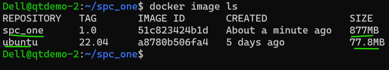
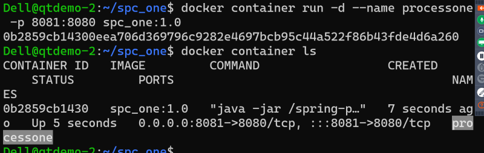
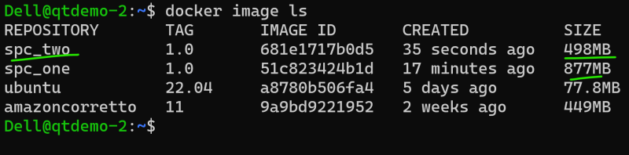
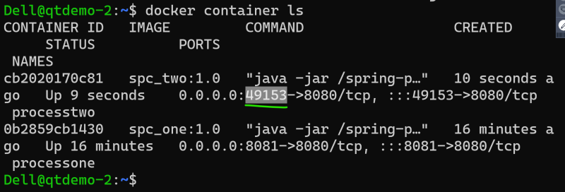
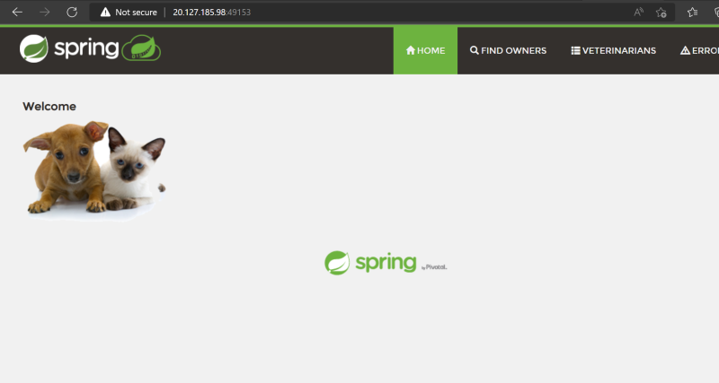

## Activity 1: Containerize the Java (Spring boot) Application
* Spring boot: This helps in building web based java applications.
* Generally to extension of the java package is ```jar``` to run the spring boot application the command is ```java -jar <package>.jar```
* Lets try to run an application ```spring pet clinic```
* To run this application we need java 11
* when we run this application it exposes port 8080
* Manual steps

```
sudo apt update
sudo apt install openjdk-11-jdk -y 
java -version
wget https://s3.us-west-2.amazonaws.com/spring-petclinic.jar
java -jar spring-petclinic-2.4.2.jar
```
* To access the petclinic application navigate to http://<publicip:8080

## Creating a container image using Dockerfile – Approach 1
* [Refer Here](https://docs.docker.com/engine/reference/builder/) for all the Dockerfile instructions
* For this activity lets stick closer to manual approach
    * Pick a base image => ubuntu:22.04
    * spring petclinic runs on port 8080
    * Steps to install are:
         ```
         sudo apt update
         sudo apt install openjdk-11-jdk -y
         wget https://referenceapplicationskhaja.s3.us-west-2.amazonaws.com/spring-petclinic.jar
         ```
    * Steps to start application:
        ```
        java -jar spring-petclinic-2.4.2.jar
        ```
    * On a highlevel to choose a base image instruction is ```FROM``` [Refer Here](https://docs.docker.com/engine/reference/builder/#from)
    * To execute any commands to install/configure application the instruction is ```RUN``` [Refer Here](https://docs.docker.com/engine/reference/builder/#run)
    * To expose the port command is ```EXPOSE``` [Refer Here](https://docs.docker.com/engine/reference/builder/#expose)
    * To start the application when container is created the instruction is ```CMD``` [Refer Here](https://docs.docker.com/engine/reference/builder/#cmd)
    * Lets try to write a Dockerfile

    ```Dockerfile
        FROM ubuntu:22.04
        RUN apt update
        RUN apt install openjdk-11-jdk wget -y
        RUN wget https://s3.us-west-2.amazonaws.com/spring-petclinic.jar
        EXPOSE 8080
        CMD ["java", "-jar", "/spring-petclinic.jar"]

    ```
    * Now create a new folder and a file with ```Dockerfile``` as a name and cpy the above contents. Create the docker image
    ```
    docker image build -t spc_one:1.0 .
    docker image ls
    ```
    
    * Lets create a container in a detached mode with name processone
    ```
    docker container run -d --name processone -p 8081:8080 spc_one:1.0
    ```
    
    * Now access the application http://<vm-ip:8081

## Approach 2:
* To run spring pet clinic i need java 11, but in the previous image i have started from ubuntu which is not necessary
* Lets use amazon correto [Refer Here](https://hub.docker.com/_/amazoncorretto)
* ADD instruction is used to copy the files into images
```Dockerfile
FROM amazoncorretto:11
ADD https://referenceapplicationskhaja.s3.us-west-2.amazonaws.com/spring-petclinic-2.4.2.jar /spring-petclinic-2.4.2.jar
EXPOSE 8080
CMD ["java", "-jar", "/spring-petclinic-2.4.2.jar"]
```
* Build the image docker image build -t spc_two:1.0 .
* List the images

* Create the container ``` docker container run --name processtwo -d -P spc_two:1.0 ```

* Now access the application

* Generally all the image publisher have slim options which further reduces the size of container on disk
Exercise: Try using ``` amazoncorreto:11-alpine-jdk ``` as base image and build spc_three