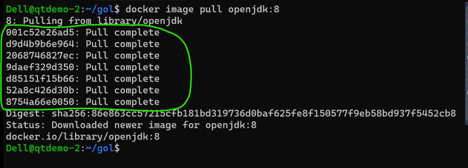

## Activity 2: Game of Life
* Manual steps:
    * Install tomcat
    * copy the war file into some directory (webapps)
* To remove container

```
docker container rm <container-id/name>
docker rm <container-id/name>
```

* To remove all containers

```
docker container rm -f $(docker container ls -a -q)
```

* To remove all images

```
docker image rm -f $(docker image ls -q)
docker rmi <container-id/name>
```
* Steps:

```
# copy the gameoflife.war into webapps folder of tomcat
```

* Lets find a image with tomcat 8 or 9 with java 8
* Lets write a Dockerfile

```Dockerfile
FROM tomcat:8-jdk8
EXPOSE 8080
ADD https://gameoflife-devopseasy.s3.us-west-2.amazonaws.com/gameoflife.war /usr/local/tomcat/webapps/gameoflife.war
CMD ["catalina.sh","run"]
```
* Now build the image ``` docker image build -t gol:0.1 . ```
* Start the container  ``` docker container run -d -p 8080:80 gol:1.0 ```

## Docker Image Layers
* Lets pull openjdk:8 image


* We are observing lot of things getting pulled as part of this image.
* Lets try one more image


* The stuff that is getting downloaded is called as image layer.
* Docker image is collection of image layers
* Lets inspect alpine:3 ``` docker image inspect alpine:3 ``` with focus on layers
* Lets create a simple Dockerfile and create a image called as trail:1.0

```
FROM alpine:3
RUN touch 1.txt 
```


* Now lets inspect trail:1.0


* Lets create one more version of trail:2.0

```
FROM alpine:3
RUN touch 1.txt
RUN touch 2.txt
```


* In the above case two layers are reused and a new layer is created.
* Docker image layers are read-only.
* The container created from image gets an extra read/write layer.
* Any changes done will be present in the read/write layer of the container not image layer.
* Docker needs a special filesystem which can show the layers mounted on each other as normal file system. To make it possible docker has special file systems such as overlay and union file system.

## Activity: Lets build a nodejs application

* Lets try to run a simple nodejs application with angularjs frontend
* The code of the application is [Refer Here](https://github.com/gothinkster/angular-realworld-example-app)
* To run this application we need
    * node js
    * npm
* Node js image [Refer Here](https://hub.docker.com/_/node)
* Manual steps:

```
git clone https://github.com/gothinkster/angular-realworld-example-app.git
cd angular-realworld-example-app
npm install -g @angular/cli
npm install
# To start the application http://localhost:4200
ng serve 
```
* LABEL instruction is used to add metadata [Refere here](https://docs.docker.com/engine/reference/builder/#label)
* WORKDIR instruction [Refer Here](https://docs.docker.com/engine/reference/builder/#workdir)
* Dockerfile provided below

```Dockerfile
FROM node:16
LABEL project="devopseasy"
LABEL author="docker-devops"
RUN git clone https://github.com/gothinkster/angular-realworld-example-app.git
RUN cd angular-realworld-example-app && npm install -g @angular/cli && npm install
EXPOSE 4200
WORKDIR /angular-realworld-example-app
CMD ["ng", "serve", "--host", "0.0.0.0"]
```
* Generally docker files are present closer to code. If we want code to be copied in the image we can use ADD . <dest>
* For copying the localfiles into image we can use two instructions 
    * ADD
        * copy from local as well as remote (web or http urls or git)
    * COPY
        * copy only from local machine.


