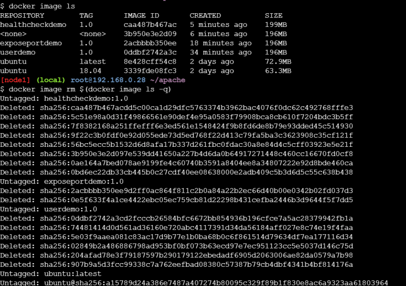

## ENV & ARG Directive/instruction
* The ENV directive is used to set environmental variables.
These environmental variables are used by applications to get information
Syntax

```
ENV <key> <value>
```
* ARG instruction is used to define the variables that the user can pass while building the image
Syntax

```
ARG <variablename>=<defaultvalue>
```
ENV variables will be available in the containers also

```Dockerfile
FROM openjdk:8
# base image is openjdk
LABEL author="Josef DevopsEasy"
LABEL maintainer="devopseasy@gmail.com"
ENV applicationpath='/springpetclinic.jar'
ENV dummy='dummy'
ARG downloadlocation
# Downloading the image from the url
ADD  ${downloadlocation} ${applicationpath}
# spring pet clinic runs on port 8080
EXPOSE 8080
# command to start the application
CMD ["java",  "-jar",  ${applicationpath} ]
```
* Now while building the images using docker file use the following commands and explore the differences

```
docker image build -t envargdemo:1.0 --build-arg downloadlocation='https://spc-jar.s3.us-west-2.amazonaws.com/spring-petclinic.jar' .

# login into the container to see the file downloaded and the environmental variables

docker container run -it envargdemo:1.0 /bin/bash

ls

echo $dummy
echo $applicationpath
exit

# Create one more container

docker container run -e dummy='test' -it envargdemo:1.0 /bin/bash
ls
echo $dummy
echo $applicationpath
exit
```

WORKDIR instruction
* In the below image we ran two different containers where the working directory of the containers are different


* By default if we donot specify the default working directory is /
* Where as in Dockerfile it is possible to change the working directory

```Dockerfile
FROM openjdk:8
# base image is openjdk
LABEL author="Josef DevopsEasy"
LABEL maintainer="devopseasy@gmail.com"
ENV applicationpath='/springpetclinic.jar'
ENV dummy='dummy'
ENV workingdirectory='/spc'
ARG downloadlocation='https://spc-jar.s3.us-west-2.amazonaws.com/spring-petclinic.jar'
RUN mkdir ${workingdirectory}
WORKDIR ${workingdirectory}
# Downloading the image from the url
ADD  ${downloadlocation} "${workingdirectory}/${applicationpath}"
# spring pet clinic runs on port 8080
EXPOSE 8080
# command to start the application
CMD ["java",  "-jar",  "${workingdirectory}/${applicationpath}" ]
```

* Now build the above Dockerfile

```
docker image build -t workdirdemo:1.0 .
```

* Now create a Docker Container

```
docker container run -it workdirdemo:1.0 /bin/bash
# now enter below commands
pwd
ls
```


## ADD and COPY instruction
* During the docker image build process we might require to copy files from our local system into docker image filesystem. This can be acheived by using COPY/ADD instruction

```
COPY <source> <destination>
ADD <source> <destination>
```
* In some cases while building docker image you might require to download the files from some urls and copy to the docker file system, then we can use ADD instruction

```
ADD <source> <destination>
```

* Create a sample index.html file for practical implementation

```html
<html>
    <body>
        <h1>Welcome to Quality Thought</h1>
    </body>
</html> 
```
* Now create a Dockerfile in same location of index.html file

```Dockerfile
FROM ubuntu:18.04
LABEL author="DevopsEasy"
RUN apt-get update && apt-get install apache2 -y
WORKDIR /var/www/html/
COPY index.html .
CMD ["echo","helloworld"] 
```

* Try to build the docker image and check the behavior of COPY and workdir

## USER instruction
* Look at the example below


* So there is some way to set the default user other than root user in DockerImage. This can be achieved by using USER instruction.

## USER, HEALTHCHECK and EXPOSE instructions
* Docker will use the root as the default user in the docker containers
* USER instruction can change this behavior and specify a non -root user ad default user

```
USER <user>
USER <user>:group
```

* Lets create a Dockerfile based on Apache Server

```Dockerfile
FROM ubuntu:18.04
LABEL author="Josef Jackson"
LABEL organization="DevopsEasy"
RUN apt update && apt-get install apache2 -y
USER www-data
CMD ["whoami"]
```
* Now build the docker image

```
docker image build -t userdemo:1.0 .
```


* Create a container and keep it running in the background


* EXPOSE instruction is used to inform Docker that a container is listenting on the specified port at run time

```
EXPOSE <port>
EXPOSE <port>/<protocol>
```
* Ports exposed Expose instruction will only be accesible within docker container
* To access the ports from the host we can use ``` -p <host-port>:<container-port> or -P ```


* To verify if the application is running or not we can create HEALTHCHECK insturction

```
HEALTHCHECK --internal=1m --timeout=2s --retries=3 CMD curl -f http://localhost/ || exit 1
```

```Dockerfile
FROM ubuntu:18.04
LABEL author="Josef Jackson"
LABEL organization="DevopsEasy"
RUN apt update && apt-get install apache2 -y && apt install curl -y
HEALTHCHECK CMD curl -f http://localhost/ || exit 1
EXPOSE 80
CMD ["apache2ctl", "-D", "FOREGROUND"]
```


* Lets remove all the containers


* Lets remove all the images



* All the containers are deleted as well as the images
Lets understand how image layers impact docker container
