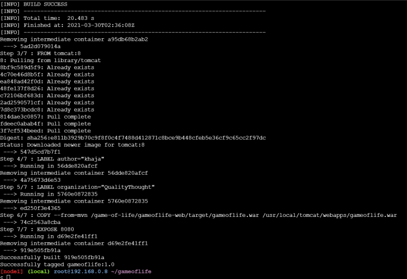
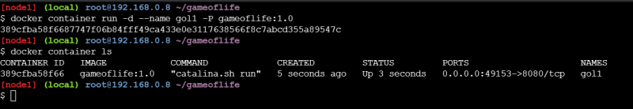
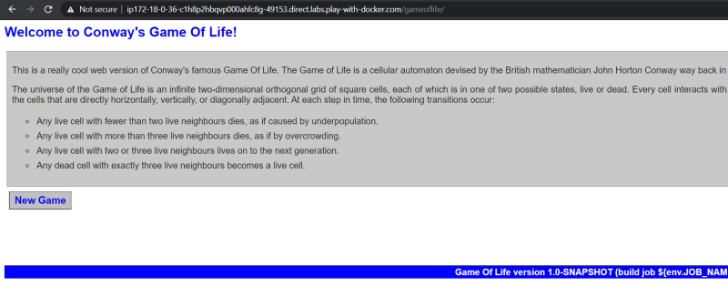

### Multi Stage Docker builds
* To build a docker image we need an application package, we build a application package on the build server and then use it in the docker file to build the application docker image.
* The idea of multi stage builds is to use docker completely to build an application package and create a docker image.
* Lets try to build the docker image for game of life [Refer Here](https://github.com/wakaleo/game-of-life) for the code of game of life
* To build this application package we need
    * git to the code
    * java to be installed
    * maven to build the code
* Manual Steps to get the application package:

```
git clone https://github.com/wakaleo/game-of-life.git
cd game-of-life
mvn package
```
* Now after the package step is successful we get the gameoflife.war which can be used in the Dockerfile to build image
* We have a docker image which is preinstalled with maven [Refer Here](https://hub.docker.com/_/maven)

```
FROM maven:3-jdk-8 AS mvn
RUN git clone https://github.com/wakaleo/game-of-life.git && cd game-of-life && mvn package


FROM tomcat:8
LABEL author="Josef"
LABEL organization="DevopsEasy"
COPY --from=mvn /game-of-life/gameoflife-web/target/gameoflife.war /usr/local/tomcat/webapps/gameoflife.war
EXPOSE 8080
```
* Now build the Dockerfile

```
docker image build -t gameoflife:1.0 .
```


* Docker first tries to build the stages in the above case it will build the mvn stage first and then it builds the docker image with the last FROM which will be what your image will have. the necessary files will be copied from stages into the Docker image depending on instructions

* Lets run the container





* Now lets try to build one more docker image using the multi staged build
