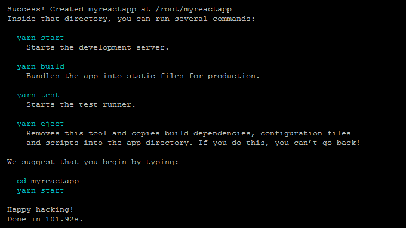
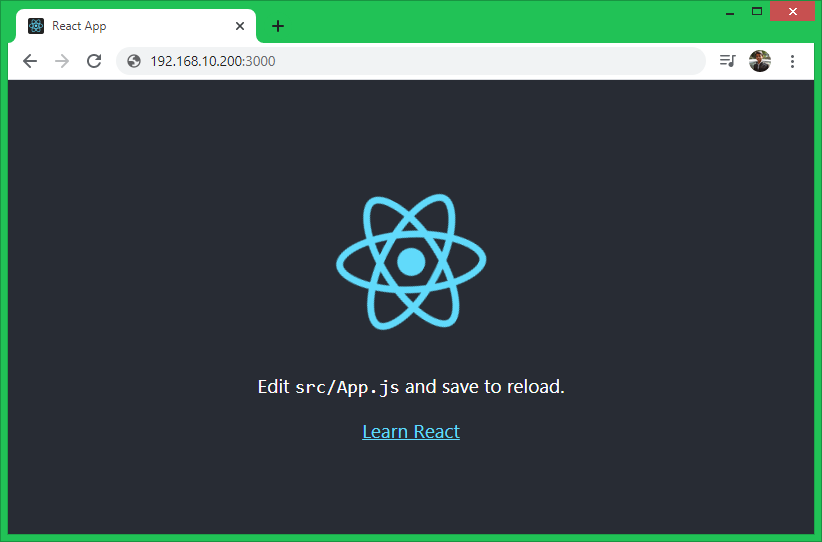

## React JS Application Deployment into Docker
* Let us see how to deploy it manually into server.

## React Application Deployment into Ubuntu Server
* For React JS we need to have nodejs installed.
* To build application we will use yarn.

## Install Node.js
* Node.js is required to create and run a React.js application. The following steps will install Node.js 14 on your Ubuntu system.
   * Add the Node.js 14 (current stable version) PPA to your Ubuntu system

   ```  curl -sL https://deb.nodesource.com/setup_14.x | sudo bash - ```

   * Next, run the following command to install the Node.js to your system:

   ``` sudo apt install nodejs -y ```

   * Finally, check the current active version of Node.js

   ``` node -v ```

   * Also install Yarn package manager on your system.

   ``` npm install -g yarn ```

## Create A New React Application

* You can create a React.js application using one of the following commands.

``` yarn create react-app devopseasy ```

* Except yarn, you can also use npx (npx create-react-app myreactapp) or npm (npm init react-app myreactapp) commands to create React.js application.

* On successful application creation, you will see a long result on screen. At the end, you will find the result like below with some useful commands.



## Start React Application

* Once you have created your React application. This will create a folder in current directory with project name. Switch to that project and run yarn start to start application.

```
 cd devopseasy
 yarn start
```
* Output:

```
Compiled successfully!

You can now view myreactapp in the browser.

  Local:            http://localhost:3000
  On Your Network:  http://192.168.10.200:3000

Note that the development build is not optimized.
To create a production build, use yarn build.
```

* The default react application start on port 3000. Access your React application using 3000 port with system IP address. For local machine use “localhost” followed by port.




## Create React.js Production Build

* Once your application is ready for production deployment. Let’s create a production build of your React application. The Production build contains static files required to run application on production environment. You don’t need to install Node.js on production servers as they don’t contains any development files.

* Use ``` yarn build ``` or ``` npm run build ``` command to create production build of your React.js application.

```
cd devopseasy
yarn build
```
* On successful build, you will see the output like below:

```
yarn run v1.22.10
$ react-scripts build
Creating an optimized production build...
Compiled successfully.

File sizes after gzip:

  41.33 KB  build/static/js/2.fefeb60f.chunk.js
  1.59 KB   build/static/js/3.63acee40.chunk.js
  1.17 KB   build/static/js/runtime-main.3da20c7a.js
  591 B     build/static/js/main.3ee865b4.chunk.js
  531 B     build/static/css/main.8c8b27cf.chunk.css

The project was built assuming it is hosted at /.
You can control this with the homepage field in your package.json.

The build folder is ready to be deployed.
You may serve it with a static server:

  yarn global add serve
  serve -s build

Find out more about deployment here:

  https://cra.link/deployment

Done in 26.59s.
```

* All the production files are created under the build directory. Upload all the content from build directory to production website document root.

* In case of any issue occurred on production server. First, you need to fix issue on local source code, then re-create the production build and re-deploy on server.

## Convert React App to Docker Container

* Create Dockerfile in project folder.

```Dockerfile
FROM node:10
WORKDIR /app
COPY . .
EXPOSE 3000
CMD ["yarn","start"]
```
* Now build this Dockerfile

``` docker image build -t reactapp . ```
* One of the disadvantage is image size was very big
* To solve this we can use thin image with multistage build approach
* Let us try to deploy to ngnix webserver using Docker MultiStage Build

```
FROM node:10 as builder
WORKDIR /app
COPY . .
RUN yarn build

FROM nginx:alpine

WORKDIR /usr/share/nginx/html

COPY --from=builder /app/build .
CMD ["nginx", "-g", "daemon off;"]
```
