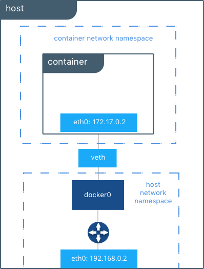
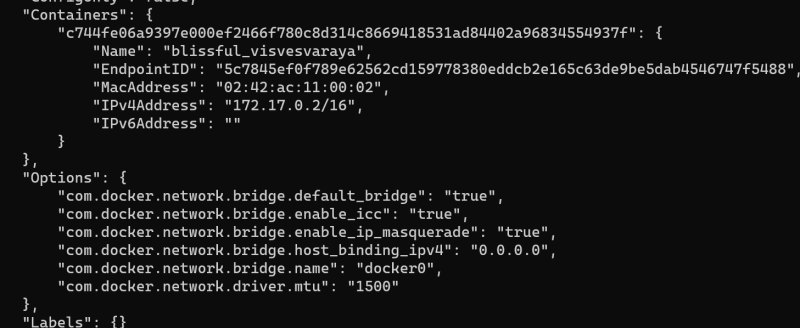
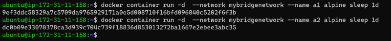
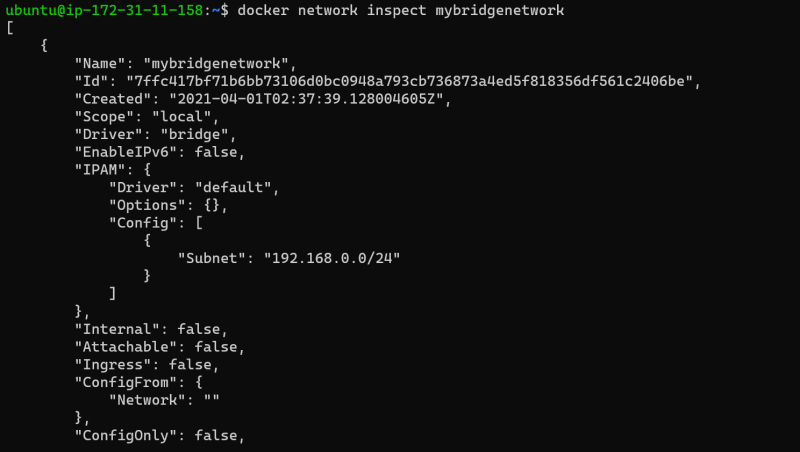
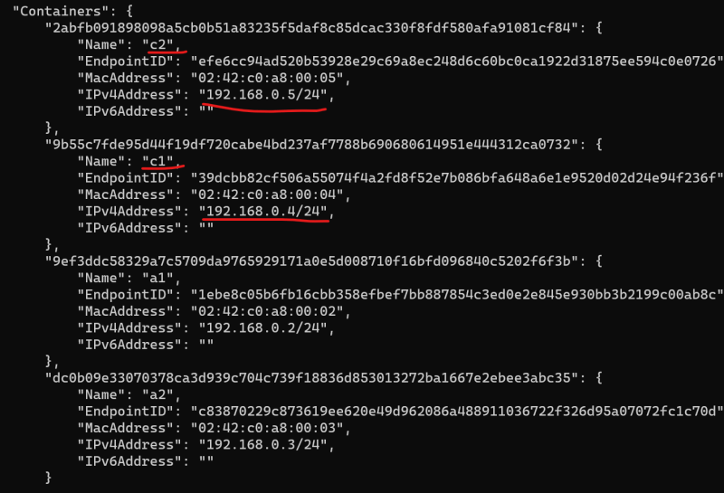

## Linux Networking Fundamentals
* Docker networking uses the kernel’s networking stack to create high level networking feature of Docker
* Docker Networking is Linux Networking
Also refer OSI Networking Model over [here](https://en.wikipedia.org/wiki/OSI_model)

## Building Blocks

## Linux Bridge
* This is layer 2 device with virtual implementation of physical switch inside Linux Kernel
* Forwards the traffic based on MAC address by inspecting traffic.

## Network Namespace
* Isolated network stack in kernel with its own interfaces, routes & firewall rules

## Virtual Ethernet Devices or veth
* Linux networking interface that acts as connecting wire between two two network namespaces

## iptables
* Generic table structure that defines rules & commands as part of the netfilter framework.

## Docker Networking Architecture
* Docker Networking Architecture is based on Container Networking Model.

## CNM Constructs – Sandbox
* Contains the configuration of the containers network stack.
* Includes routing tables, container’s interfaces, DNS setting etc.
* Sample implementation could be Linux Network Namespace or any other similar concept.

## CNM Constructs – Endpoint
* Joins sandbox to the Network.
* This abstracts actual connection to the network away from application.
* Maintains portability for applications, so that they can use different network drivers

## CNM Constructs – Network
* Collection of endpoints having connectivity b/w themselves

## CNM Driver Interfaces
* CNM provides two pluggable & open interfaces to leverage additional functionality and control in the network
    * Network Drivers
    * IPAM Drivers
    

## Docker Native Network Drivers

## Host
* Container uses the networking stack of the host.

## Bridge
* Creates a bridge on the host that is managed by Docker.
* All containers on Bridge Driver can communicate among themselves
* Default Driver

## Overlay
* Used for multi-host networks.
* Uses local linux bridges & VXLAN to overlay container-to-container networking

## MACVLAN
* uses Linux MACVLAN bridge to establish connection b/w container interfaces & parent host interfaces
* MAC address can be attached to each container

## None

### Docker Networking Scopes
* Local: provides connectivity within host
* Swarm: provides connectivity across swarm cluster

## Tutorials
* [Bridege](https://docs.docker.com/network/network-tutorial-standalone/)
* [Host](https://docs.docker.com/network/network-tutorial-host/)
* [Overlay](https://docs.docker.com/network/network-tutorial-overlay/)

## Host Network Driver
* In host network driver all the containers are in same network namespace(sandbox)

## Bridge Network Driver
* Default Bridge Network Driver

* User-Defined Bridge Networks

## Practical Implementation
* Images of the commands used in class

* On the default bridge n/w we can establish communication b/w two containers using ip addresses but not by names

* Now lets create two more containers in our user-defined bridge network

* Now lets login into a1 container and check the connectivity with a2

* We can connect the running containers to a different network

* All the containers in the same network will have n/w communication but the containers in different n/ws will not have connectivity
* In the case of windows for single host networking we have nat driver which is similar to bridge in linux and we have transparent driver which is similar to host driver in linux
* Application and database containers on single host

* Now when we run our containers on a single host and if this host is down then our application also will be down. So we need a solution where we can run docker containers on different hosts and there should be n/w connectivity b/w them
* The bridge/nat/host/transperent drivers can create a network which has a scope of single host (local)
* So we need to understand multihost docker networking
